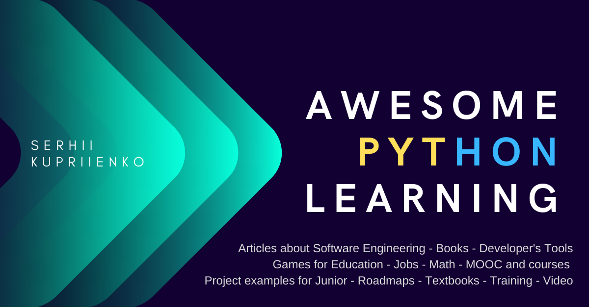

# Awesome-Python-Learning v.1.2.0

## Full list of links
See full list with categories in [Awesome_Python_Learning.csv](Awesome_Python_Learning.csv)

Python Learning Library

## **Contents**

	Jobs
	Programming (learning)
		Roadmaps
		MOOC and courses
			Video
		Textbooks
		Books
		Games for Education
		Online education (others)
		IT-events
		Training
		Project examples for Junior
		Puzzles
		Developer's Tools
		Articles about Software Engineering

------

## **Jobs**

- [[15 App Ideas to Build and Level Up your Coding Skills]](https://blog.bitsrc.io/15-app-ideas-to-build-and-level-up-your-coding-skills-28612c72a3b1)
- [[15 вопросов по Python: как джуниору пройти собеседование]](https://proglib.io/p/python-interview/)
- [[15 задач на собеседовании для программиста]](https://proglib.io/p/15-questions-for-programmers/)
- [[16-річний програміст із Черкащини --- про те, як 11-класником влаштувався на роботу зі зарплатнею майже \$1000 \| DOU]](https://dou.ua/lenta/interviews/first-job-in-sixteen/?from=comment-digest_bc&utm_source=transactional&utm_medium=email&utm_campaign=digest-comments#1829186)

- [[5 советов по созданию вашего резюме]](https://proglib.io/p/best-format-on-cv/)

- [[50+ Data Structure and Algorithms Problems from Coding Interviews - DEV Community 👩‍💻👨‍💻]](https://dev.to/javinpaul/50-data-structure-and-algorithms-problems-from-coding-interviews-4lh2)

- [[53 Python Interview Questions and Answers - Towards Data Science]](https://towardsdatascience.com/53-python-interview-questions-and-answers-91fa311eec3f)

- [[hh.ua]](https://kiev.hh.ua/applicant/resumes?from=header_new)

- [[How to write a killer Software Engineering résumé - freeCodeCamp.org - Medium]](https://medium.com/free-code-camp/writing-a-killer-software-engineering-resume-b11c91ef699d)

- [[Job search, venture investing & new tech products \| AngelList]](https://angel.co/)

- [[Python програмісти - Джин]](https://djinni.co/developers/?sortby=rating&title=Python&utm_medium=email&utm_source=transactional&utm_campaign=email%2Fcandidate_weeklystats.html)

- [[Top 100 Data Structure and Algorithm Interview Questions for Java Programmers \| Java67]](https://www.java67.com/2018/06/data-structure-and-algorithm-interview-questions-programmers.html)

- [[Top 75 Programming Interview Questions Answers to Crack Any Coding Job Interview \| Java67]](https://www.java67.com/2018/05/top-75-programming-interview-questions-answers.html)

- [[What I want (and don't want) to see on your software engineering resume]](https://medium.com/job-advice-for-software-engineers/what-i-want-and-dont-want-to-see-on-your-software-engineering-resume-cbc07913f7f6)

- [[Вакансії \| DOU]](https://jobs.dou.ua/)

- [[Вастрик.Инсайд \#39: Войти в айти. Нужен ли диплом? Как учиться новому? Как оставаться востребованным? Есть ли жизнь после 30?]](https://vas3k.ru/inside/39/)

- [[Вастрик.Инсайд \#46: Краткий гайд о том, как нанимать нормальных людей]](https://vas3k.ru/inside/46/)

- [[Де, як і скільки: аналізуємо найм джуніорів у 2019 році \| DOU]](https://dou.ua/lenta/articles/juniors-2019/?from=nl&utm_source=20200428&utm_medium=email&utm_campaign=CM)

- [[Как должно выглядеть резюме ИТ-специалиста: типичные ошибки глазами HR]](https://proglib.io/p/it-cv/)

- [[Как успешно пройти любое техническое собеседование]](https://proglib.io/p/programming-interview-success/)

- [[Работа]](https://rabota.ua/)

## **Programming (learning)**

### **Roadmaps**

- [[My Data Science & Machine Learning, Beginner's Learning Path \| LinkedIn]](https://www.linkedin.com/pulse/my-data-science-machine-learning-beginners-path-vin-vashishta/?trackingId=J16vYmqLQEZ5wr4oElpnNA%3D%3D)

- [[AI & ML дайджест \#17: курсы по ML & DL, обзор популярных GAN архитектур, AI бот для ребенка \| DOU]](https://dou.ua/lenta/digests/ai-ml-digest-17/?from=nl&utm_source=20200414&utm_medium=email&utm_campaign=CM)

- [[Data Science Career Guide -- Dataquest]](https://www.dataquest.io/blog/data-science-career-guide/?utm_source=Iterable&utm_medium=email&utm_campaign=onboarding_7)

- [[Data Science Career Tips Archives -- Dataquest]](https://www.dataquest.io/blog/topics/data-science-career-tips/?utm_source=Iterable&utm_medium=email&utm_campaign=onboarding_7)

- [[Full-Stack JavaScript in Six Weeks: A Curriculum Guide]](https://medium.com/ladies-storm-hackathons/follow-this-curriculum-to-learn-full-stack-javascript-in-six-weeks-c0f100426902)

- [[Grow]](https://grow.telescopeai.com/pdp/)

- [[Grow]](https://grow.telescopeai.com/templates)

- [[How to become a data scientist? - Towards Data Science]](https://towardsdatascience.com/how-to-become-a-data-scientist-3f8d6e75482f)

- [[How we built our first full-stack JavaScript web app in three weeks]](https://medium.com/ladies-storm-hackathons/how-we-built-our-first-full-stack-javascript-web-app-in-three-weeks-8a4668dbd67c)

- [[If I had to start learning Data Science again, how would I do it?]](https://towardsdatascience.com/if-i-had-to-start-learning-data-science-again-how-would-i-do-it-78a72b80fd93)

- [[omreps/programmer-competency-matrix: ENG -\> RU: Матрица компетентности программиста, мой перевод]](https://github.com/omreps/programmer-competency-matrix)

- [[Pandas Урок --- чтение файлов csv, создание dataframe и фильтрация данных]](https://pythonru.com/uroki/osnovy-pandas-1-chtenie-fajlov-dataframe-otbor-dannyh)

- [[Programmer Competency Matrix -- Sijin Joseph]](http://sijinjoseph.com/programmer-competency-matrix/)

- [[programmer-competency-matrix/partII.md at master · omreps/programmer-competency-matrix]](https://github.com/omreps/programmer-competency-matrix/blob/master/partII.md)

- [[Python Developers Survey 2019 Results \| JetBrains: Developer Tools for Professionals and Teams]](https://www.jetbrains.com/lp/python-developers-survey-2019/?utm_source=Iterable&utm_medium=email&utm_campaign=newsletter_82)

- [[Quiz: Data Engineer, Data Analyst, Data Scientist --- Which Role Fits You?]](https://www.dataquest.io/blog/data-analyst-data-scientist-data-engineer/)

- [[Resources I Wish I Knew When I Started Out With Data Science]](https://towardsdatascience.com/resources-i-wish-i-knew-when-i-started-out-with-data-science-9a8889654c36)

- [[Roadmap • mlcourse.ai]](https://mlcourse.ai/roadmap)

- [[Top 10 In-Demand programming languages to learn in 2020]](https://towardsdatascience.com/top-10-in-demand-programming-languages-to-learn-in-2020-4462eb7d8d3e)

- [[Warning: Your programming career - SoloLearn - Medium]](https://medium.com/sololearn/warning-your-programming-career-b9579b3a878b)

- [[Дайджест материалов по трудоустройству в сфере IT]](https://proglib.io/p/it-job-digest/)

- [[Детальный план самообразования в Computer Science за 1.5 года]](https://proglib.io/p/cs-learning/)

- [[Мапа розвитку в Data Science, або Як стати дослідником даних \| DOU]](https://dou.ua/lenta/articles/how-i-became-data-analyst/?from=comment-digest_post&utm_source=transactional&utm_medium=email&utm_campaign=digest-comments)

- [[Программирование на Python: от новичка до профессионала]](https://proglib.io/p/python-from-newbie-to-professional/)

- [[Путь Python Junior-а в 2017]](https://proglib.io/p/python-junior-2017/)

- [[Развивать себя]](https://grow.telescopeai.com/landing/youRU)

- [[Советы сеньоров: как прокачать знания junior Front-end/JavaScript \| DOU]](https://dou.ua/lenta/articles/senior-frontend-tips/)

- [[Хочу стать веб-разработчиком: подробный план по изучению JavaScript]](https://tproger.ru/curriculum/javascript-curriculum/)

### **MOOC and courses**

- [[\[UNИX\]\[Python-Dev\] Лекция 1. Разработка ПО. Индивидуальное использование GIT - YouTube]](https://www.youtube.com/watch?v=wOBSo09owqs&list=PLPErILqzuTQqXEIjjN6gwFzV1yRuwReR0)

- [[11.1 - Regular Expressions - Мичиганский университет \| Coursera]](https://www.coursera.org/learn/python-network-data/lecture/bMyWb/11-1-regular-expressions)

- [[200+ SQL Interview Questions and Answers for Developers \| Udemy]](https://www.udemy.com/course/sql-interview-questions/?LSNPUBID=JVFxdTr9V80&ranEAID=JVFxdTr9V80&ranMID=39197&ranSiteID=JVFxdTr9V80-vfc1VkvwmmFDsRFTJ0oVtw)

- [[6.006: Introduction to Algorithms - Massachusetts Institute of Technology]](https://courses.csail.mit.edu/6.006/fall11/notes.shtml)

- [[Advanced Operating Systems]](https://www.udacity.com/course/advanced-operating-systems--ud189)

- [[AI For Everyone --- главная \| Coursera]](https://www.coursera.org/learn/ai-for-everyone/home/welcome)

- [[Algorithmic Toolbox \| Coursera]](https://www.coursera.org/learn/algorithmic-toolbox?recoOrder=5&utm_medium=email&utm_source=recommendations&utm_campaign=recommendationsEmail~recs_email~2020-03-30)

- [[Amazon Web Services Sign-In]](https://signin.aws.amazon.com/signin?redirect_uri=https%3A%2F%2Fus-west-2.console.aws.amazon.com%2Fcloud9%2Fide%2Fca383e00d67748bc81e6a66a723090d7%3Fstate%3DhashArgs%2523%26isauthcode%3Dtrue&client_id=arn%3Aaws%3Aiam%3A%3A015428540659%3Auser%2Fcloud9&forceMobileApp=0&code_challenge=apBGk2U19lHSfFKRF4VO4W6Hbadtr4AQfklozCXltAY&code_challenge_method=SHA-256)

- [[An Introduction to Interactive Programming in Python (Part 1) - Rice University \| Coursera]](https://www.coursera.org/learn/interactive-python-1/home/info)

- [[An Introduction to Interactive Programming in Python (Part 1) --- главная \| Coursera]](https://www.coursera.org/learn/interactive-python-1/home/welcome)

- [[AP®︎ Computer Science Principles (AP®︎ CSP) \| Khan Academy]](https://www.khanacademy.org/computing/ap-computer-science-principles)

- [[App Maker Academy \| LEARN]](https://learn.by/courses/course-v1:EPAM+AMA+ext1/about)

- [[Applied Machine Learning in Python --- главная \| Coursera]](https://www.coursera.org/learn/python-machine-learning/home/welcome)

- [[Applied Machine Learning in Python \| Coursera]](https://www.coursera.org/learn/python-machine-learning?specialization=data-science-python)

- [[Applied Plotting, Charting & Data Representation in Python \| Coursera]](https://www.coursera.org/learn/python-plotting)

- [[Applied Plotting, Charting & Data Representation in Python \| Coursera]](https://www.coursera.org/learn/python-plotting?specialization=data-science-python)

- [[Applied Social Network Analysis in Python \| Coursera]](https://www.coursera.org/learn/python-social-network-analysis)

- [[Applied Text Mining in Python \| Coursera]](https://www.coursera.org/learn/python-text-mining)

- [[Applied Text Mining in Python \| Coursera]](https://www.coursera.org/learn/python-text-mining?specialization=data-science-python)

- [[Artificial Intelligence]](https://www.udacity.com/course/artificial-intelligence--ud954)

- [[Artificial Intelligence for Robotics \| Udacity]](https://www.udacity.com/course/artificial-intelligence-for-robotics--cs373)

- [[Basics of Software Architecture & Design Patterns in Java \| Udemy]](https://www.udemy.com/course/basics-of-software-architecture-design-in-java/?LSNPUBID=JVFxdTr9V80&ranEAID=JVFxdTr9V80&ranMID=39197&ranSiteID=JVFxdTr9V80-KOKGxDo89w69mkjZQRXoiw)

- [[Become a Python Developer]](https://www.linkedin.com/learning/paths/become-a-python-developer)

- [[Become a Solution Architect: Architecture Course \| Udemy]](https://www.udemy.com/course/how-to-become-an-outstanding-solution-architect/?LSNPUBID=JVFxdTr9V80&ranEAID=JVFxdTr9V80&ranMID=39197&ranSiteID=JVFxdTr9V80-V.PfRaGSBVyIDs0jrROOXQ)

- [[Big Data Analytics in Healthcare]](https://www.udacity.com/course/big-data-analytics-in-healthcare--ud758)

- [[Bootcamp - Scrimba Tutorial]](https://scrimba.com/p/pG66Msa/c66k2RCr)

- [[Bootstrap 4 Tutorial - Learn Bootstrap For Free \| Scrimba]](https://scrimba.com/g/gbootstrap4)

- [[Break Away: Programming And Coding Interviews \| Udemy]](https://www.udemy.com/course/break-away-coding-interviews-1/?LSNPUBID=JVFxdTr9V80&ranEAID=JVFxdTr9V80&ranMID=39197&ranSiteID=JVFxdTr9V80-xK68R9T0iKj38_3pS1WcYg)

- [[Caesar - CS50x]](https://cs50.harvard.edu/x/2020/psets/2/caesar/)

- [[Chat with React - Scrimba Tutorial]](https://scrimba.com/p/pbNpTv/c9bWPAp)

- [[Clean Code \| LEARN]](https://learn.by/courses/course-v1:EPAM+CC+ext1/about)

- [[Client-Server Communication]](https://www.udacity.com/course/client-server-communication--ud897)

- [[Code Basics: основы программирования]](https://ru.code-basics.com/languages/javascript/modules/basics/lessons/comments)

- [[Codecademy]](https://www.codecademy.com/catalog/subject/all)

- [[CodeSkulptor]](http://www.codeskulptor.org/)

- [[Coding for Kids \| Tynker]](https://www.tynker.com/lesson/host)

- [[Coding Interview Bootcamp Algorithms, Data Structures Course \| Udemy]](https://www.udemy.com/course/coding-interview-bootcamp-algorithms-and-data-structure/?LSNPUBID=JVFxdTr9V80&ranEAID=JVFxdTr9V80&ranMID=39197&ranSiteID=JVFxdTr9V80-TlXTfAkPvfYsaAfzlBDfzw)

- [[Command Line Essentials: Git Bash for Windows \| Udemy]](https://www.udemy.com/course/git-bash/learn/lecture/2723932#overview)

- [[Computability, Complexity & Algorithms]](https://www.udacity.com/course/computability-complexity-algorithms--ud061)

- [[Computability, Complexity & Algorithms - Udacity]](https://classroom.udacity.com/courses/ud061)

- [[Computer programming \| Computing \| Khan Academy]](https://www.khanacademy.org/computing/computer-programming)

- [[Computer science \| Computing \| Khan Academy]](https://www.khanacademy.org/computing/computer-science)

- [[Continuous Integration and Continuous Delivery using Interactive Browser-Based Labs \| Katacoda]](https://www.katacoda.com/courses/cicd)

- [[Continuous Integration with Jenkins \| LEARN]](https://learn.by/courses/course-v1:EPAM+CIJ+ext1/about)

- [[Convolutional Neural Networks \| Coursera]](https://www.coursera.org/learn/convolutional-neural-networks?specialization=deep-learning)

- [[Course \| 15.071x \| edX]](https://courses.edx.org/courses/course-v1:MITx+15.071x+1T2020/course/)

- [[Course \| CS1301xII \| edX]](https://courses.edx.org/courses/course-v1:GTx+CS1301xII+3T2019/course/)

- [[Course Introduction: Neural Networks in JavaScript - Scrimba Tutorial]](https://scrimba.com/p/pVZJQfg/cv4rvCR)

- [[Course overview]](https://www.robomindacademy.com/navigator/courses)

- [[Course Overview - Scrimba Tutorial]](https://scrimba.com/p/pQxesM/ce4baHb)

- [[Courses \| edX]](https://www.edx.org/course/introduction-python-data-science-2)

- [[Courses \| LEARN]](https://learn.by/courses)

- [[Crash Course on Python --- главная \| Coursera]](https://www.coursera.org/learn/python-crash-course/home/info)

- [[CS 436: Distributed Computer Systems - Lecture 1 - YouTube]](https://www.youtube.com/watch?v=w8KFPWkK0bI&list=PLawkBQ15NDEkDJ5IyLIJUTZ1rRM9YQq6N)

- [[CSS - Scrimba Tutorial]](https://scrimba.com/p/pWvwCg/c3vBJu2)

- [[Dashboard \| Khan Academy]](https://www.khanacademy.org/profile/kaid_319771232046788166624019/courses)

- [[Data Analysis and Visualization]](https://www.udacity.com/course/data-analysis-and-visualization--ud404)

- [[Data Analysis Learning Path \| Springboard]](https://www.springboard.com/learning-paths/data-analysis/learn/?referral=https://www.springboard.com/resources/learning-paths/data-analysis/#351-introduction-to-algorithms)

- [[Data Science A-Z™: Real-Life Data Science Exercises Included \| Udemy]](https://www.udemy.com/course/datascience/?LSNPUBID=JVFxdTr9V80&ranEAID=JVFxdTr9V80&ranMID=39197&ranSiteID=JVFxdTr9V80-ehAZ1CgIaMuZej9hJQmD5A)

- [[Data Science Dream Job - YouTube]](https://www.youtube.com/channel/UCr6_XCxMLXWGguWZi_93n7w)

- [[Data Science Interview Prep]](https://www.udacity.com/course/data-science-interview-prep--ud944)

- [[Data Science Office Hours - YouTube]](https://www.youtube.com/channel/UC5c7r0SlnNmPfqxEyni71FA)

- [[Data Science with R \| Pluralsight]](https://www.pluralsight.com/courses/r-data-science?clickid=2FASLxUR5xyOUgVwUx0Mo3EWUki2W90Cx3OTW80&irgwc=1&mpid=1193463&utm_source=impactradius&utm_medium=digital_affiliate&utm_campaign=1193463&aid=7010a000001xAKZAA2)

- [[Data Scientist Path: Interactive Python, SQL \| Dataquest]](https://app.dataquest.io/path/data-scientist)

- [[Data Structure - Part I \| Udemy]](https://www.udemy.com/course/data-structures-part-1-lognacademy/learn/lecture/2587894#overview)

- [[Data Structures and Performance \| Coursera]](https://www.coursera.org/learn/data-structures-optimizing-performance?recoOrder=9&utm_medium=email&utm_source=recommendations&utm_campaign=recommendationsEmail~recs_email~2020-03-30)

- [[Data Structures Fundamentals]](https://courses.edx.org/courses/course-v1:UCSanDiegoX+ALGS201x+1T2019/course/)

- [[Data Visualization in Python --- DataCamp]](https://www.datacamp.com/resources/webinars/data-visualization-in-python)

- [[Data Wrangling with MongoDB]](https://www.udacity.com/course/data-wrangling-with-mongodb--ud032)

- [[Database Systems Concepts & Design]](https://www.udacity.com/course/database-systems-concepts-design--ud150)

- [[DataCamp]](https://learn.datacamp.com/)

- [[Datatypes & Typecasting - Scrimba Tutorial]](https://scrimba.com/p/pNpZMAB/cgqp9rSz)

- [[DBA1 : Компания Postgres Professional]](https://postgrespro.ru/education/courses/DBA1)

- [[DBA2 : Компания Postgres Professional]](https://postgrespro.ru/education/courses/DBA2)

- [[Deep learning на пальцах!]](https://dlcourse.ai/)

- [[Design of Computer Programs]](https://www.udacity.com/course/design-of-computer-programs--cs212)

- [[Design of Computer Programs - Udacity]](https://classroom.udacity.com/courses/cs212)

- [[Designing RESTful APIs]](https://www.udacity.com/course/designing-restful-apis--ud388)

- [[Developing AI Applications on Azure --- главная \| Coursera]](https://www.coursera.org/learn/developing-ai-applications-azure/home/welcome)

- [[Differential Equations in Action]](https://www.udacity.com/course/differential-equations-in-action--cs222)

- [[Divide and Conquer, Sorting and Searching, and Randomized Algorithms \| Coursera]](https://www.coursera.org/learn/algorithms-divide-conquer)

- [[DJANGO CHANNELS 2 Tutorial (V2) - Real Time - WebSockets - Async - YouTube]](https://www.youtube.com/watch?v=RVH05S1qab8)

- [[Docker Swarm Mode Playground \| Katacoda]](https://www.katacoda.com/courses/docker-orchestration/playground)

- [[DZone: Programming & DevOps news, tutorials & tools]](https://dzone.com/refcardz?filter=popular)

- [[Easy to Advanced Data Structures \| Udemy]](https://www.udemy.com/course/introduction-to-data-structures/?LSNPUBID=JVFxdTr9V80&ranEAID=JVFxdTr9V80&ranMID=39197&ranSiteID=JVFxdTr9V80-P91lzG_giImwniobx2X3Jg)

- [[Easy to Advanced Data Structures \| Udemy]](https://www.udemy.com/course/introduction-to-data-structures/?LSNPUBID=JVFxdTr9V80&ranEAID=JVFxdTr9V80&ranMID=39197&ranSiteID=JVFxdTr9V80-ZbkYrZOIS7t4Ikpe7FLW_A)

- [[Exercise files]](https://www.linkedin.com/learning/python-essential-training-2/exercise-files?pathUrn=urn%3Ali%3AlyndaLearningPath%3A56db2f4b3dd5596be4e4989f)

- [[Exercises on the Python Track \| Exercism]](https://exercism.io/tracks/python/exercises)

- [[Explore - LeetCode]](https://leetcode.com/explore/)

- [[Free Clean Architecture Course: Patterns, Practices, and Principles for Beginners \| Pluralsight]](https://www.pluralsight.com/courses/clean-architecture-patterns-practices-principles?clickid=2FASLxUR5xyOUgVwUx0Mo3EWUki2TWVKx3OTW80&irgwc=1&mpid=1193463&utm_source=impactradius&utm_medium=digital_affiliate&utm_campaign=1193463&aid=7010a000001xAKZAA2)

- [[Free Software Architect Course: Developer to Architect \| Pluralsight]](https://www.pluralsight.com/courses/developer-to-architect?clickid=2FASLxUR5xyOUgVwUx0Mo3EWUki2TWVrx3OTW80&irgwc=1&mpid=1193463&utm_source=impactradius&utm_medium=digital_affiliate&utm_campaign=1193463&aid=7010a000001xAKZAA2)

- [[Free SOLID Course: Principles of Object Oriented Design \| Pluralsight]](https://www.pluralsight.com/courses/principles-oo-design?clickid=2FASLxUR5xyOUgVwUx0Mo3EWUki2W4xqx3OTW80&irgwc=1&mpid=1193463&utm_source=impactradius&utm_medium=digital_affiliate&utm_campaign=1193463&aid=7010a000001xAKZAA2)

- [[Front Matter --- Alembic 1.4.2 documentation]](https://alembic.sqlalchemy.org/en/latest/front.html#installation)

- [[Front-End Web UI Frameworks and Tools: Bootstrap 4 --- главная \| Coursera]](https://www.coursera.org/learn/bootstrap-4/home/welcome?utm_campaign=mgT_0F1wEem5a3PcVrpGrg&utm_medium=email&utm_source=learner)

- [[Full Stack Foundations]](https://www.udacity.com/course/full-stack-foundations--ud088)

- [[Git Playground \| Katacoda]](https://www.katacoda.com/courses/git/playground)

- [[Git Started with GitHub \| Udemy]](https://www.udemy.com/course/git-started-with-github/learn/lecture/2918876#overview)

- [[Graph Search, Shortest Paths, and Data Structures --- главная \| Coursera]](https://www.coursera.org/learn/algorithms-graphs-data-structures/home/welcome)

- [[Graph Search, Shortest Paths, and Data Structures \| Coursera]](https://www.coursera.org/learn/algorithms-graphs-data-structures)

- [[Greedy Algorithms, Minimum Spanning Trees, and Dynamic Programming \| Coursera]](https://www.coursera.org/learn/algorithms-greedy)

- [[Grok Learning]](https://groklearning.com/launch/#language=javascript&language=python&language=sql&level=beginners&level=intermediate&level=advanced)

- [[Grokking the System Design Interview - Learn Interactively]](https://www.educative.io/courses/grokking-the-system-design-interview?affiliate_id=5073518643380224)

- [[GT - Refresher - Advanced OS]](https://www.udacity.com/course/gt-refresher-advanced-os--ud098)

- [[Harvard CS109 Data Science Course, Resources Free and Online]](https://www.kdnuggets.com/2013/11/harvard-cs109-data-science-course-resources-free-online.html)

- [[High Performance Computer Architecture]](https://www.udacity.com/course/high-performance-computer-architecture--ud007)

- [[High Performance Computing]](https://www.udacity.com/course/high-performance-computing--ud281)

- [[HTTP & Web Servers]](https://www.udacity.com/course/http-web-servers--ud303)

- [[HTTP & Web Servers - Udacity]](https://classroom.udacity.com/courses/ud303)

- [[https://scratch.mit.edu/projects/374672500/editor]](https://scratch.mit.edu/projects/374672500/editor)

- [[Improving Deep Neural Networks: Hyperparameter tuning, Regularization and Optimization \| Coursera]](https://www.coursera.org/learn/deep-neural-network?specialization=deep-learning)

- [[Inferential Statistical Analysis with Python --- главная \| Coursera]](https://www.coursera.org/learn/inferential-statistical-analysis-python/home/welcome)

- [[Input and output -- Intro to Interviewing -- Grasshopper]](https://learn.grasshopper.app/project/intro-to-interviewing)

- [[Intel® Edge AI Fundamentals with OpenVINO™]](https://www.udacity.com/course/intel-edge-AI-fundamentals-with-openvino--ud132)

- [[Intro to Algorithms - Udacity]](https://classroom.udacity.com/courses/cs215)

- [[Intro to Algorithms \| Udacity]](https://www.udacity.com/course/intro-to-algorithms--cs215)

- [[Intro to Artificial Intelligence - Udacity]](https://classroom.udacity.com/courses/cs271)

- [[Intro to Backend - Udacity]](https://classroom.udacity.com/courses/ud171)

- [[Intro to Data Analysis \| Udacity]](https://www.udacity.com/course/intro-to-data-analysis--ud170)

- [[Intro to Data Science]](https://www.udacity.com/course/intro-to-data-science--ud359)

- [[Intro to Data Science]](https://www.udacity.com/course/intro-to-data-science--ud359)

- [[Intro to Data Structures and Algorithms]](https://www.udacity.com/course/data-structures-and-algorithms-in-python--ud513)

- [[Intro to Deep Learning with PyTorch]](https://www.udacity.com/course/deep-learning-pytorch--ud188)

- [[Intro to Descriptive Statistics]](https://www.udacity.com/course/intro-to-descriptive-statistics--ud827)

- [[Intro to DevOps]](https://www.udacity.com/course/intro-to-devops--ud611)

- [[Intro To Dynamic Programming - Coding Interview Preparation \| Udemy]](https://www.udemy.com/course/dynamic-programming/?LSNPUBID=JVFxdTr9V80&ranEAID=JVFxdTr9V80&ranMID=39197&ranSiteID=JVFxdTr9V80-5t_2vOX4idtKYG4iSwTiag)

- [[Intro To Dynamic Programming - Coding Interview Preparation \| Udemy]](https://www.udemy.com/course/dynamic-programming/?LSNPUBID=JVFxdTr9V80&ranEAID=JVFxdTr9V80&ranMID=39197&ranSiteID=JVFxdTr9V80-qJwyifi_MKZkj41MTaaH.Q)

- [[Intro to Flask Series - YouTube]](https://www.youtube.com/playlist?list=PLXmMXHVSvS-AjwTOtiW1DXFYTgUlrUmHV)

- [[Intro to Hadoop and MapReduce]](https://www.udacity.com/course/intro-to-hadoop-and-mapreduce--ud617)

- [[Python Tutorial for Beginners]](https://intellipaat.com/blog/tutorial/python-tutorial/)

- [[Intro to Inferential Statistics]](https://www.udacity.com/course/intro-to-inferential-statistics--ud201)

- [[Intro to Progressive Web Apps]](https://www.udacity.com/course/intro-to-progressive-web-apps--ud811)

- [[Intro to Relational Databases]](https://www.udacity.com/course/intro-to-relational-databases--ud197)

- [[Intro to the Design of Everyday Things]](https://www.udacity.com/course/intro-to-the-design-of-everyday-things--design101)

- [[Intro to Theoretical Computer Science]](https://www.udacity.com/course/intro-to-theoretical-computer-science--cs313)

- [[Introduction - Scrimba Tutorial]](https://scrimba.com/p/pPPeCy/c7veET3)

- [[Introduction to Computational Thinking and Data Science \| edX]](https://www.edx.org/course/introduction-to-computational-thinking-and-data-4?source=aw&awc=6798_1531898458_2bba85670feb320e9c65b2b6f704ee06&utm_source=aw&utm_medium=affiliate_partner&utm_content=text-link&utm_term=301045_https%3A%2F%2Fwww.class-central.com%2F)

- [[Introduction to Computer Vision]](https://www.udacity.com/course/introduction-to-computer-vision--ud810)

- [[Introduction to D3 - Scrimba Tutorial]](https://scrimba.com/p/pb4WsX/c2bB4hN)

- [[Introduction to Data Science in Python \| Coursera]](https://www.coursera.org/learn/python-data-analysis)

- [[Introduction to Data Science in Python \| Coursera]](https://www.coursera.org/learn/python-data-analysis?specialization=data-science-python)

- [[Introduction to Dynamical Systems and Chaos]](https://www.complexityexplorer.org/courses/91-introduction-to-dynamical-systems-and-chaos)

- [[Introduction to Graduate Algorithms]](https://www.udacity.com/course/introduction-to-graduate-algorithms--ud401)

- [[Introduction to GraphQL \| GraphQL]](https://graphql.org/learn/)

- [[Introduction to JavaScript \| Codecademy]](https://www.codecademy.com/learn/introduction-to-javascript)

- [[Introduction to Machine Learning - Online Course \| DataCamp]](https://learn.datacamp.com/courses/introduction-to-machine-learning-with-r)

- [[Introduction to Machine Learning Course \| Udacity]](https://www.udacity.com/course/intro-to-machine-learning--ud120)

- [[Introduction to Operating Systems]](https://www.udacity.com/course/introduction-to-operating-systems--ud923)

- [[Introduction to Operating Systems - Udacity]](https://classroom.udacity.com/courses/ud923)

- [[Introduction to Python Programming - Udacity]](https://classroom.udacity.com/courses/ud1110)

- [[Introduction to Python Programming \| Udacity]](https://www.udacity.com/course/introduction-to-python--ud1110)

- [[Introduction To Python Programming \| Udemy]](https://www.udemy.com/course/pythonforbeginnersintro/learn/lecture/7717096#overview)

- [[Introduction to Scripting in Python \| Coursera]](https://www.coursera.org/specializations/introduction-scripting-in-python)

- [[IT Курсы программирования онлайн - обучение программированию, видео уроки \| ITVDN]](https://itvdn.com/ru)

- [[JavaScript ES6 Intro - Scrimba Tutorial]](https://scrimba.com/p/p7v3gCd/cvk2Jfd)

- [[Kaggle Mercedes и кросс-валидация / Блог компании Open Data Science / Хабр]](https://habr.com/ru/company/ods/blog/336168/)

- [[Katacoda - Interactive Learning Platform for Software Engineers]](https://www.katacoda.com/)

- [[Katacoda - Interactive Learning Platform for Software Engineers]](https://www.katacoda.com/)

- [[Khan Academy \| Free Online Courses, Lessons & Practice]](https://www.khanacademy.org/#statistics)

- [[Knowledge-Based AI: Cognitive Systems]](https://www.udacity.com/course/knowledge-based-ai-cognitive-systems--ud409)

- [[Learn \| freeCodeCamp.org]](https://www.freecodecamp.org/learn)

- [[Learn CI/CD with Jenkins using Interactive Browser-Based Labs \| Katacoda]](https://www.katacoda.com/courses/jenkins)

- [[Learn CSS Animations]](https://scrimba.com/g/gcssanimations?utm_source=newsletter&utm_medium=email&utm_campaign=gcssanimations_mainlist_launch)

- [[Learn Data Analysis using Pandas and Python (Module 2/3) \| Udemy]](https://www.udemy.com/course/learn-data-analysis-using-pandas-and-python/learn/lecture/11211074)

- [[Learn Data Structures and Algorithms: Ace the Coding Interview \| Udemy]](https://www.udemy.com/course/learn-data-structure-algorithms-with-java-interview/?LSNPUBID=JVFxdTr9V80&ranEAID=JVFxdTr9V80&ranMID=39197&ranSiteID=JVFxdTr9V80-UtExCtEfwxOwPM48vP0X6g)

- [[Learn Data Visualization Tutorials \| Kaggle]](https://www.kaggle.com/learn/data-visualization)

- [[Learn Git Version Control using Interactive Browser-Based Labs \| Katacoda]](https://www.katacoda.com/courses/git)

- [[Learn How to Code \| Codecademy]](https://www.codecademy.com/learn/learn-how-to-code)

- [[Learn Intermediate Machine Learning Tutorials \| Kaggle]](https://www.kaggle.com/learn/intermediate-machine-learning)

- [[Learn Intro to Machine Learning Tutorials \| Kaggle]](https://www.kaggle.com/learn/intro-to-machine-learning)

- [[Learn Kubernetes using Interactive Browser-Based Labs \| Katacoda]](https://www.katacoda.com/courses/kubernetes)

- [[Learn Machine Learning using Interactive Browser-Based Labs \| Katacoda]](https://www.katacoda.com/courses/machine-learning)

- [[Learn Pandas Tutorials \| Kaggle]](https://www.kaggle.com/learn/pandas)

- [[Learn Python - Full Course for Beginners \[Tutorial\] - YouTube]](https://www.youtube.com/watch?v=rfscVS0vtbw)

- [[Learn Python 3.6 for Total Beginners \| Udemy]](https://www.udemy.com/course/python-3-for-total-beginners/learn/lecture/8389008#overview)

- [[Learn Python for Data Science, Structures, Algorithms, Interviews \| Udemy]](https://www.udemy.com/course/python-for-data-science-and-machine-learning-bootcamp/?LSNPUBID=JVFxdTr9V80&ranEAID=JVFxdTr9V80&ranMID=39197&ranSiteID=JVFxdTr9V80-SmD2rWBa9X3v_xfqcTwS9g)

- [[Learn Python for Data Structures, Algorithms & Interviews \| Udemy]](https://www.udemy.com/course/python-for-data-structures-algorithms-and-interviews/?LSNPUBID=JVFxdTr9V80&ranEAID=JVFxdTr9V80&ranMID=39197&ranSiteID=JVFxdTr9V80-Y4DoHDW7JqaAhp8UbYY1Vw)

- [[Learn Python: Build a Virtual Assistant \| Udemy]](https://www.udemy.com/course/learn-python-build-a-virtual-assistant-in-python/learn/lecture/5078926)

- [[Learn Serverless and Functions/FaaS Technologies using Interactive Browser-Based Labs \| Katacoda]](https://www.katacoda.com/courses/serverless)

- [[Learn SQL \| Codecademy]](https://www.codecademy.com/learn/learn-sql)

- [[Learn to Code with Interactive Tutorials \| Scrimba]](https://scrimba.com/)

- [[Learn to Program: Crafting Quality Code --- главная \| Coursera]](https://www.coursera.org/learn/program-code/home/welcome)

- [[Learn to Program: The Fundamentals --- главная \| Coursera]](https://www.coursera.org/learn/learn-to-program/home/info)

- [[Lecture 1: Administrivia; Introduction; Analysis of Algorithms, Insertion Sort, Mergesort \| Video Lectures \| Introduction to Algorithms (SMA 5503) \| Electrical Engineering and Computer Science \| MIT OpenCourseWare]](https://ocw.mit.edu/courses/electrical-engineering-and-computer-science/6-046j-introduction-to-algorithms-sma-5503-fall-2005/video-lectures/lecture-1-administrivia-introduction-analysis-of-algorithms-insertion-sort-mergesort/)

- [[Linear Algebra Refresher Course]](https://www.udacity.com/course/linear-algebra-refresher-course--ud953)

- [[Livestreams \| Codecademy]](https://www.codecademy.com/learn/livestreams)

- [[Machine Learning]](https://www.udacity.com/course/machine-learning--ud262)

- [[Machine Learning A-Z (Python & R in Data Science Course) \| Udemy]](https://www.udemy.com/course/machinelearning/?LSNPUBID=JVFxdTr9V80&ranEAID=JVFxdTr9V80&ranMID=39197&ranSiteID=JVFxdTr9V80-Sv8Zh6oY0Us.D_q0ZY03tA)

- [[Machine Learning Course Outline \| Course Outline \| CSMM.102x Courseware \| edX]](https://courses.edx.org/courses/course-v1:ColumbiaX+CSMM.102x+1T2020/courseware/2945e520da3f4b86bae2a390887faa10/0e0bc99270ad4788ba4d306467d6ea0c/)

- [[Machine Learning Foundations: A Case Study Approach \| Coursera]](https://www.coursera.org/learn/ml-foundations?siteID=SAyYsTvLiGQ-j1V0zZ5fHhcoOM0BkeGXuw&utm_content=10&utm_medium=partners&utm_source=linkshare&utm_campaign=SAyYsTvLiGQ)

- [[Machine Learning in Python (Data Science and Deep Learning) \| Udemy]](https://www.udemy.com/course/data-science-and-machine-learning-with-python-hands-on/?LSNPUBID=JVFxdTr9V80&ranEAID=JVFxdTr9V80&ranMID=39197&ranSiteID=JVFxdTr9V80-Tt64BSk_T3eae86HjaaI6Q)

- [[Machine Learning Interview Preparation]](https://www.udacity.com/course/machine-learning-interview-prep--ud1001)

- [[Machine Learning with TensorFlow on Google Cloud Platform \| Coursera]](https://www.coursera.org/specializations/machine-learning-tensorflow-gcp?)

- [[Machine Learning: Unsupervised Learning]](https://www.udacity.com/course/machine-learning-unsupervised-learning--ud741)

- [[Master Object Oriented Programming Concepts \| Udemy]](https://www.udemy.com/course/master-object-oriented-programming-concepts/learn/lecture/14292436#overview)

- [[Master Python for Data Science]](https://www.linkedin.com/learning/paths/master-python-for-data-science)

- [[Mathematics for Computer Science \| Electrical Engineering and Computer Science \| MIT OpenCourseWare]](https://ocw.mit.edu/courses/electrical-engineering-and-computer-science/6-042j-mathematics-for-computer-science-fall-2010/index.htm)

- [[Mathematics for Computer Science \| Electrical Engineering and Computer Science \| MIT OpenCourseWare]](https://ocw.mit.edu/courses/electrical-engineering-and-computer-science/6-042j-mathematics-for-computer-science-fall-2010/)

- [[Microsoft: Our new free Python programming language courses are for novice AI developers \| ZDNet]](https://www.zdnet.com/google-amp/article/microsoft-our-new-free-python-programming-language-courses-are-for-novice-ai-developers/)

- [[MIT 6.042J Mathematics for Computer Science]](https://www.youtube.com/watch?v=L3LMbpZIKhQ)

- [[Neural Networks and Deep Learning --- главная \| Coursera]](https://www.coursera.org/learn/neural-networks-deep-learning/home/welcome)

- [[Node.js Playground \| Katacoda]](https://www.katacoda.com/courses/nodejs/playground)

- [[Nonlinear Dynamics: Mathematical and Computational Approaches]](https://www.complexityexplorer.org/courses/92-nonlinear-dynamics-mathematical-and-computational-approaches)

- [[Open Data Science (ODS.ai)]](https://ods.ai/)

- [[Open Data Science (ODS.ai)]](https://ods.ai/)

- [[Open Machine Learning Course mlcourse.ai • mlcourse.ai]](https://mlcourse.ai/)

- [[ossu/computer-science: Path to a free self-taught education in Computer Science!]](https://github.com/ossu/computer-science)

- [[Practical Deep Learning for Coders, v3 \| fast.ai course v3]](https://course.fast.ai/)

- [[Probabilistic Graphical Models 1: Representation \| Coursera]](https://www.coursera.org/learn/probabilistic-graphical-models)

- [[Programming Languages]](https://www.udacity.com/course/programming-languages--cs262)

- [[PY4E - Python for Everybody]](https://www.py4e.com/html3/11-regex)

- [[Python - OOP \| Udemy]](https://www.udemy.com/course/python-oop/learn/lecture/11878738#overview)

- [[Python - YouTube]](https://www.youtube.com/playlist?list=PL-_cKNuVAYAXkJLFpu-dq3nphjftOOR6C)

- [[Python \| CoderNet]](https://codernet.ru/videos/python/)

- [[Python 3, BBC Microbit, and MicroPython Bootcamp \| Udemy]](https://www.udemy.com/course/python-3-bootcamp/?LSNPUBID=JVFxdTr9V80&ranEAID=JVFxdTr9V80&ranMID=39197&ranSiteID=JVFxdTr9V80-yt_5odS.FhZtVvCiK.As3A)

- [[Python 3.4 Programming Tutorials - YouTube]](https://www.youtube.com/playlist?list=PL6gx4Cwl9DGAcbMi1sH6oAMk4JHw91mC_)

- [[Python Basics --- главная \| Coursera]](https://www.coursera.org/learn/python-basics/home/info)

- [[Python for Big Data Analytics - Edureka]](https://www.edureka.co/blog/videos/python-for-big-data-analytics/#utm_content=buffer09e67)

- [[Python for Data Science \| edX]](https://www.edx.org/course/python-for-data-science-2?source=aw&awc=6798_1531898412_43bdbbbd83e68a090303b818a7c981ed)

- [[Python for Data Science \| edX]](https://www.edx.org/course/python-for-data-science-2)

- [[Python OOP : Four Pillars of OOP in Python 3 for Beginners \| Udemy]](https://www.udemy.com/course/python-oops-beginners/?LSNPUBID=JVFxdTr9V80&ranEAID=JVFxdTr9V80&ranMID=39197&ranSiteID=JVFxdTr9V80-uMbd4yXuF6XDw3mBAVT4Mg)

- [[Python OOP : Four Pillars of OOP in Python 3 for Beginners \| Udemy]](https://www.udemy.com/course/python-oops-beginners/?LSNPUBID=JVFxdTr9V80&ranEAID=JVFxdTr9V80&ranMID=39197&ranSiteID=JVFxdTr9V80-Nr4tBMduhid_6vaIlWdcqg)

- [[Python Playground \| Katacoda]](https://www.katacoda.com/courses/python/playground)

- [[Python Programming - Build a Reconnaissance Scanner \| Udemy]](https://www.udemy.com/course/python-programming-build-a-reconnaissance-scanner/learn/lecture/3964992#overview)

- [[Python Programming - YouTube]](https://www.youtube.com/watch?v=N4mEzFDjqtA)

- [[Python Programming for Beginners - Learn in 100 Easy Steps \| Udemy]](https://www.udemy.com/course/python-tutorial-for-beginners/?LSNPUBID=JVFxdTr9V80&ranEAID=JVFxdTr9V80&ranMID=39197&ranSiteID=JVFxdTr9V80-3rVEPCsYZocttcQCmzYBNg)

- [[Python Programming: A Concise Introduction --- главная \| Coursera]](https://www.coursera.org/learn/python-programming-introduction/home/info)

- [[Python Track \| Exercism]](https://exercism.io/my/tracks/python)

- [[Python Tutorials - YouTube]](https://www.youtube.com/playlist?list=PL-osiE80TeTt2d9bfVyTiXJA-UTHn6WwU)

- [[Python Variables]](https://www.w3schools.com/python/python_variables.asp)

- [[Python: Object Oriented Programming \| Udemy]](https://www.udemy.com/course/python-object-oriented-programming/?LSNPUBID=JVFxdTr9V80&ranEAID=JVFxdTr9V80&ranMID=39197&ranSiteID=JVFxdTr9V80-_XEuwOZ_8ATanV5IEXa0Cw)

- [[python: Online Courses, Training and Tutorials on LinkedIn Learning]](https://www.linkedin.com/learning/search?entityType=LEARNING_PATH&keywords=python)

- [[Quickstart for Cloud SQL for PostgreSQL  \|  Google Cloud]](https://cloud.google.com/sql/docs/postgres/quickstart)

- [[R Language Playground \| Katacoda]](https://www.katacoda.com/courses/rlang/playground)

- [[React - Scrimba Tutorial]](https://scrimba.com/p/p7P5Hd/cWKkvVuL)

- [[React & Django TUTORIAL Integration // REACTify Django - YouTube]](https://www.youtube.com/watch?v=AHhQRHE8IR8&t=37s)

- [[React Tutorial: Learn React JS For Free \| Scrimba]](https://scrimba.com/g/glearnreact)

- [[Reading: Welcome \| Welcome \| ALGS201x Courseware \| edX]](https://courses.edx.org/courses/course-v1:UCSanDiegoX+ALGS201x+1T2019/courseware/5d2fce07f792430dad418f828b327e98/ea2153a2fabc400e88b87b4668755dd2/)

- [[Real-Time Analytics with Apache Storm]](https://www.udacity.com/course/real-time-analytics-with-apache-storm--ud381)

- [[Regular Expressions Intro - Scrimba Tutorial]](https://scrimba.com/p/peyvVAN/c7mweAZ)

- [[Responsive Images]](https://www.udacity.com/course/responsive-images--ud882)

- [[Rock Paper Scissors - Python Tutorial \| Udemy]](https://www.udemy.com/course/rock-paper-scissors-python/learn/lecture/4175270#overview)

- [[RPA: Automation Anywhere: Example: Ticket Processing - YouTube]](https://www.youtube.com/watch?v=YjWRhtL1D2E)

- [[Scalable Microservices with Kubernetes]](https://www.udacity.com/course/scalable-microservices-with-kubernetes--ud615)

- [[Scipy Lecture Notes --- Scipy lecture notes]](https://scipy-lectures.org/)

- [[Self-Driving Fundamentals: Featuring Apollo]](https://www.udacity.com/course/self-driving-car-fundamentals-featuring-apollo--ud0419)

- [[Sequence Models \| Coursera]](https://www.coursera.org/learn/nlp-sequence-models)

- [[Shortest Paths Revisited, NP-Complete Problems and What To Do About Them \| Coursera]](https://www.coursera.org/learn/algorithms-npcomplete)

- [[Software Architecture & Design]](https://www.udacity.com/course/software-architecture-design--ud821)

- [[Software Development Methodologies \| LEARN]](https://learn.by/courses/course-v1:EPAM+SDM+ext1/about)

- [[Software Development Processes and Methodologies \| Coursera]](https://www.coursera.org/learn/software-processes)

- [[Software Testing Introduction (RUS) \| LEARN]](https://learn.by/courses/course-v1:EPAM+STI+ext/about)

- [[Spark]](https://www.udacity.com/course/learn-spark-at-udacity--ud2002)

- [[SQL for Data Analysis \| Udacity]](https://www.udacity.com/course/sql-for-data-analysis--ud198)

- [[Stanford Engineering Everywhere \| CS229 - Machine Learning]](https://see.stanford.edu/Course/CS229)

- [[Story by Data - YouTube]](https://www.youtube.com/channel/UCU9GTVEPqlSNRDHypVf3BRw)

- [[Structuring Machine Learning Projects \| Coursera]](https://www.coursera.org/learn/machine-learning-projects?specialization=deep-learning)

- [[TensorFlow Getting Started using Interactive Browser-Based Labs \| Katacoda]](https://www.katacoda.com/basiafusinska/courses/tensorflow-getting-started)

- [[Textbook \| Calculus Online Textbook \| MIT OpenCourseWare]](https://ocw.mit.edu/resources/res-18-001-calculus-online-textbook-spring-2005/textbook/)

- [[The Bits and Bytes of Computer Networking \| Coursera]](https://www.coursera.org/learn/computer-networking)

- [[The Ultimate GIT 5-day Challenge \| Udemy]](https://www.udemy.com/course/the-ultimate-git-5-day-challenge/learn/lecture/7668630#overview)

- [[Tick Tock, Tick Tock -- Етап 9 -- Stepik]](https://stepik.org/lesson/26053/step/9?unit=8085)

- [[Top Coding Interview Questions (Essential to Getting Hired) \| Udemy]](https://www.udemy.com/course/11-essential-coding-interview-questions/?LSNPUBID=JVFxdTr9V80&ranEAID=JVFxdTr9V80&ranMID=39197&ranSiteID=JVFxdTr9V80-SXOVEmlGNn4OcRAoNiSv9w)

- [[Try Django 1.11 // Python Web Development \| Udemy]](https://www.udemy.com/course/try-django-v1-11-python-web-development/learn/lecture/7604588?LSNPUBID=JVFxdTr9V80&components=purchase%2Ccacheable_buy_button%2Cbuy_button%2Crecommendation&ranEAID=JVFxdTr9V80&ranMID=39197&ranSiteID=JVFxdTr9V80-Qsj0.d13.VSGccsgRd1Jnw&persist_locale=&locale=ru_RU#overview)

- [[Try DJANGO Tutorial Series - YouTube]](https://www.youtube.com/playlist?list=PLEsfXFp6DpzTD1BD1aWNxS2Ep06vIkaeW)

- [[Try DJANGO TUTORIAL Series (v2.2) // PYTHON Web Development with Django version 2.2 - YouTube]](https://www.youtube.com/watch?v=-oQvMHpKkms&t=50s)

- [[TypeScript: Introduction - Scrimba Tutorial]](https://scrimba.com/p/pKwrCg/cEQBWH3)

- [[Ubuntu Playground \| Katacoda]](https://www.katacoda.com/courses/ubuntu/playground)

- [[UI design - Scrimba Tutorial]](https://scrimba.com/p/prpYaAy/cEKWgWSN)

- [[Using Databases with Python \| Coursera]](https://www.coursera.org/learn/python-databases)

- [[Version Control with Git]](https://www.udacity.com/course/version-control-with-git--ud123)

- [[Video \| Version control with Git \| VCG Courseware \| LEARN]](https://learn.by/courses/course-v1:EPAM+VCG+ext1/courseware/8a58c84fd1d2474b8f69a15171f524ae/59ea97521eb949c2a43dc360eb062fff/1)

- [[Video Lectures \| Introduction to Algorithms (SMA 5503) \| Electrical Engineering and Computer Science \| MIT OpenCourseWare]](https://ocw.mit.edu/courses/electrical-engineering-and-computer-science/6-046j-introduction-to-algorithms-sma-5503-fall-2005/video-lectures/)

- [[Video Lectures \| Introduction to Computer Science and Programming \| Electrical Engineering and Computer Science \| MIT OpenCourseWare]](https://ocw.mit.edu/courses/electrical-engineering-and-computer-science/6-00-introduction-to-computer-science-and-programming-fall-2008/video-lectures/)

- [[Video Lectures \| Mathematics for Computer Science \| Electrical Engineering and Computer Science \| MIT OpenCourseWare]](https://ocw.mit.edu/courses/electrical-engineering-and-computer-science/6-042j-mathematics-for-computer-science-fall-2010/video-lectures/)

- [[Visual Studio Code Playground \| vscode \| Katacoda]](https://www.katacoda.com/courses/vscode/playground)

- [[Web Application & Software Architecture 101 - Learn Interactively]](https://www.educative.io/courses/web-application-software-architecture-101?affiliate_id=5073518643380224)

- [[Web Design, Business, Technology Classes and Immersives \| General Assembly]](https://generalassemb.ly/education)

- [[Web Tooling & Automation]](https://www.udacity.com/course/web-tooling-automation--ud892)

- [[WebDriver \| LEARN]](https://learn.by/courses/course-v1:EPAM+WD+ext1/about)

- [[Web-Services Introduction \| LEARN]](https://learn.by/courses/course-v1:EpamSystems+EPAM_WB_intro+2019_T1/about)

- [[Website Performance Optimization]](https://www.udacity.com/course/website-performance-optimization--ud884)

- [[Week 2 \| Week 2 \| CS50 Courseware \| edX]](https://courses.edx.org/courses/course-v1:HarvardX+CS50+X/courseware/b94adcd6bd6b4e69b2af7eef0d828674/7e8a56384ddf4142a59bb01b65629c52/?child=first)

- [[Welcome 👋 to Vue.js! - Scrimba Tutorial]](https://scrimba.com/p/pZ45Hz/cK8RnSd)

- [[Алгоритмы \| Coursera]](https://www.coursera.org/specializations/algorithms)

- [[Алгоритмы на Python 3. Лекция №1 - YouTube]](https://www.youtube.com/watch?v=KdZ4HF1SrFs&list=PLRDzFCPr95fK7tr47883DFUbm4GeOjjc0)

- [[Алгоритмы, часть I \| Coursera]](https://www.coursera.org/learn/algorithms-part1?siteID=SAyYsTvLiGQ-DWX_zVQKujUOEJDI8HTy7A&utm_content=10&utm_medium=partners&utm_source=linkshare&utm_campaign=SAyYsTvLiGQ)

- [[Алгоритмы, часть I \| Coursera]](https://www.coursera.org/learn/algorithms-part1?ranMID=40328&ranEAID=JVFxdTr9V80&ranSiteID=JVFxdTr9V80-cRruDpdyWoRlqNubOm14Tg&siteID=JVFxdTr9V80-cRruDpdyWoRlqNubOm14Tg&utm_content=10&utm_medium=partners&utm_source=linkshare&utm_campaign=JVFxdTr9V80)

- [[Алгоритмы, часть II \| Coursera]](https://www.coursera.org/learn/algorithms-part2?siteID=SAyYsTvLiGQ-PYOgJJcBycUDIM0OB9WI8Q&utm_content=10&utm_medium=partners&utm_source=linkshare&utm_campaign=SAyYsTvLiGQ)

- [[Алгоритмы, часть II \| Coursera]](https://www.coursera.org/learn/algorithms-part2?ranMID=40328&ranEAID=JVFxdTr9V80&ranSiteID=JVFxdTr9V80-izoUUiGPVhA7d3.eGWiVSQ&siteID=JVFxdTr9V80-izoUUiGPVhA7d3.eGWiVSQ&utm_content=10&utm_medium=partners&utm_source=linkshare&utm_campaign=JVFxdTr9V80)

- [[Алексей Савватеев \" Математический анализ. Анонс\" - YouTube]](https://www.youtube.com/watch?v=gqttVWXn7p8&list=PLlx2izuC9gjgEWu2364R6GnrY8SMUYi-E)

- [[Аналіз даних та статистичне виведення на мові R \| Prometheus]](https://courses.prometheus.org.ua/courses/IRF/Stat101/2016_T3/about)

- [[Бесплатное учебное руководство по теме \"NumPy\" --- Deep Learning Prerequisites: The Numpy Stack in Python \| Udemy]](https://www.udemy.com/course/deep-learning-prerequisites-the-numpy-stack-in-python/?LSNPUBID=JVFxdTr9V80&ranEAID=JVFxdTr9V80&ranMID=39197&ranSiteID=JVFxdTr9V80-F4KrvYM0rt_cHRD.CbWkBQ)

- [[Бесплатное учебное руководство по теме \"Python\" --- Learn Python 3.6 for Total Beginners \| Udemy]](https://www.udemy.com/course/python-3-for-total-beginners/?LSNPUBID=JVFxdTr9V80&ranEAID=JVFxdTr9V80&ranMID=39197&ranSiteID=JVFxdTr9V80-oM2ZIYMnMagUaWggNNt8Tg)

- [[Введение в математическое мышление \| Coursera]](https://www.coursera.org/learn/mathematical-thinking)

- [[Введение в математическое мышление \| Coursera]](https://www.coursera.org/learn/mathematical-thinking?siteID=SAyYsTvLiGQ-l3O1WTQmZJJNOReT5kSisQ&utm_content=10&utm_medium=partners&utm_source=linkshare&utm_campaign=SAyYsTvLiGQ)

- [[Введение в науку о данных \| Coursera]](https://www.coursera.org/specializations/introduction-data-science?ranMID=40328&ranEAID=JVFxdTr9V80&ranSiteID=JVFxdTr9V80-iS2ZFBhzbNlqafIT7kggTA&siteID=JVFxdTr9V80-iS2ZFBhzbNlqafIT7kggTA&utm_content=10&utm_medium=partners&utm_source=linkshare&utm_campaign=JVFxdTr9V80)

- [[Введение в программирование с MATLAB \| Coursera]](https://www.coursera.org/learn/matlab?siteID=SAyYsTvLiGQ-LSoMASywYXrg3X7fF_V0eg&utm_content=10&utm_medium=partners&utm_source=linkshare&utm_campaign=SAyYsTvLiGQ)

- [[Візуалізація даних \| Prometheus]](https://courses.prometheus.org.ua/courses/IRF/DV101/2016_T3/about)

- [[Высшая математика для заочников и не только]](http://mathprofi.ru/)

- [[Глубокое обучение \| Coursera]](https://www.coursera.org/specializations/deep-learning?action=enroll&authMode=signup&utm_campaign=WebsiteCoursesDLSTopButton&utm_medium=institutions&utm_source=deeplearningai)

- [[Глубокое обучение \| Coursera]](https://www.coursera.org/specializations/deep-learning)

- [[Интерактивные курсы --- HTML Academy]](https://htmlacademy.ru/courses)

- [[Інформація про курс CS50 \| Prometheus]](https://courses.prometheus.org.ua/courses/course-v1:Prometheus+CS50+2019_T1/info)

- [[Ключевые аспекты разработки на Python - Курсы по программированию]](https://ru.hexlet.io/courses/python-development-course)

- [[Корисні ресурси для програміста (оновив 11 травня 2020) \| DOU]](https://dou.ua/forums/topic/26544/)

- [[Курсы по программированию]](https://ru.hexlet.io/courses?pricing_type_eq=free)

- [[Машинне навчання \| Prometheus]](https://courses.prometheus.org.ua/courses/IRF/ML101/2016_T3/about)

- [[Машинное обучение \| Coursera]](https://www.coursera.org/learn/machine-learning)

- [[Машинное обучение \| Coursera]](https://www.coursera.org/learn/machine-learning?ranMID=40328&ranEAID=JVFxdTr9V80&ranSiteID=JVFxdTr9V80-oESoY8qkZMT.slfFc4HQpw&siteID=JVFxdTr9V80-oESoY8qkZMT.slfFc4HQpw&utm_content=10&utm_medium=partners&utm_source=linkshare&utm_campaign=JVFxdTr9V80)

- [[Машинное обучение \| Coursera]](https://www.coursera.org/specializations/machine-learning?ranMID=40328&ranEAID=JVFxdTr9V80&ranSiteID=JVFxdTr9V80-3jZBK_BJODd9KiGHawegMg&siteID=JVFxdTr9V80-3jZBK_BJODd9KiGHawegMg&utm_content=10&utm_medium=partners&utm_source=linkshare&utm_campaign=JVFxdTr9V80)

- [[Машинное обучение для людей :: Разбираемся простыми словами :: Блог Вастрик.ру]](https://vas3k.ru/blog/machine_learning/)

- [[Начало]](https://compscicenter.ru/courses/python/2015-autumn/classes/1364/)

- [[Нейронные сети и глубокое обучение \| Coursera]](https://www.coursera.org/learn/neural-networks-deep-learning?specialization=deep-learning)

- [[Онлайн-курсы --- когда угодно, где угодно \| Udemy]](https://www.udemy.com/cart/subscribe/course/808422/)

- [[Онлайн-курсы Computer Science Center]](https://compscicenter.ru/online/)

- [[Основи програмування CS50 2019 \| Prometheus]](https://courses.prometheus.org.ua/courses/course-v1:Prometheus+CS50+2019_T1/about)

- [[Основы React.js]](https://learn.javascript.ru/screencast/react)

- [[Основы компьютерных вычислений \| Coursera]](https://www.coursera.org/specializations/computer-fundamentals)

- [[Открытый курс машинного обучения. Тема 1. Первичный анализ данных с Pandas / Блог компании Open Data Science / Хабр]](https://habr.com/ru/company/ods/blog/322626/)

- [[Открытый курс машинного обучения. Тема 2: Визуализация данных c Python / Блог компании Open Data Science / Хабр]](https://habr.com/ru/company/ods/blog/323210/)

- [[Открытый курс машинного обучения. Тема 3. Классификация, деревья решений и метод ближайших соседей / Open Data Science corporate blog / Habr]](https://habr.com/en/company/ods/blog/322534/#derevo-resheniy)

- [[Открытый курс машинного обучения. Тема 3. Классификация, деревья решений и метод ближайших соседей / Блог компании Open Data Science / Хабр]](https://habr.com/ru/company/ods/blog/322534/)

- [[Панель курсів \| Prometheus]](https://courses.prometheus.org.ua/dashboard)

- [[Практическое компьютерное обучение \| Coursera]](https://www.coursera.org/learn/practical-machine-learning?courseSlug=practical-machine-learning&showOnboardingModal=true&siteID=SAyYsTvLiGQ-AiRobBFiNhOX2__wxKDUBg&utm_campaign=SAyYsTvLiGQ&utm_content=10&utm_medium=partners&utm_source=linkshare)

- [[Прикладная наука о данных с Python \| Coursera]](https://www.coursera.org/specializations/data-science-python)

- [[Программирование мобильных приложений для портативных систем на базе Android: Часть 1 \| Coursera]](https://www.coursera.org/learn/android-programming?siteID=SAyYsTvLiGQ-6PCL2eb.Bt6eXiifkJCcxQ&utm_content=10&utm_medium=partners&utm_source=linkshare&utm_campaign=SAyYsTvLiGQ)

- [[Программирование мобильных приложений для портативных систем на базе Android: Часть 2 \| Coursera]](https://www.coursera.org/learn/android-programming-2?siteID=SAyYsTvLiGQ-4lrOStZNI5FfHqS0bB2sVg&utm_content=10&utm_medium=partners&utm_source=linkshare&utm_campaign=SAyYsTvLiGQ)

- [[Программирование на Python \| Coursera]](https://www.coursera.org/specializations/programming-in-python)

- [[Профессиональная сертификация \'Google IT Automation with Python\' \| Coursera]](https://www.coursera.org/professional-certificates/google-it-automation?ranMID=40328&ranEAID=JVFxdTr9V80&ranSiteID=JVFxdTr9V80-2G2cp1Grl76lCbmcds.8.A&siteID=JVFxdTr9V80-2G2cp1Grl76lCbmcds.8.A&utm_content=10&utm_medium=partners&utm_source=linkshare&utm_campaign=JVFxdTr9V80)

- [[Разведочный анализ данных \| Coursera]](https://www.coursera.org/learn/exploratory-data-analysis?siteID=SAyYsTvLiGQ-a6bPdq0USJFLoTVZMMv8Fw&utm_content=10&utm_medium=partners&utm_source=linkshare&utm_campaign=SAyYsTvLiGQ)

- [[Разработка и проектирование адаптивных веб-сайтов \| Coursera]](https://www.coursera.org/specializations/website-development?recoOrder=8&utm_medium=email&utm_source=recommendations&utm_campaign=recommendationsEmail~recs_email~2020-03-30)

- [[Розробка та аналіз алгоритмів. Частина 1 \| Prometheus]](https://edx.prometheus.org.ua/courses/KPI/Algorithms101/2015_Spring/about)

- [[Скринкаст по Angular]](https://learn.javascript.ru/screencast/angular)

- [[Скринкаст по Gulp]](https://learn.javascript.ru/screencast/gulp)

- [[Скринкаст по Node.JS]](https://learn.javascript.ru/screencast/nodejs)

- [[Скринкаст по Webpack]](https://learn.javascript.ru/screencast/webpack)

- [[Современный учебник JavaScript]](https://learn.javascript.ru/)

- [[Структуры данных в Python \| Coursera]](https://www.coursera.org/learn/python-data?siteID=SAyYsTvLiGQ-MOrZ7pDRePyazJCxqmOixQ&utm_content=10&utm_medium=partners&utm_source=linkshare&utm_campaign=SAyYsTvLiGQ)

- [[Структуры и алгоритмы данных \| Coursera]](https://www.coursera.org/specializations/data-structures-algorithms)

- [[Теория вероятностей для начинающих \| Coursera]](https://www.coursera.org/learn/probability-theory-basics)

- [[Теория игр \| Coursera]](https://www.coursera.org/learn/game-theory-1)

- [[Уроки по Python для начинающих и программистов \~ PythonRu]](https://pythonru.com/uroki)

- [[Учимся программировать: основы \| Coursera]](https://www.coursera.org/learn/learn-to-program?siteID=SAyYsTvLiGQ-CjJZj4Z4fjD5yiEYr0tQUA&utm_content=10&utm_medium=partners&utm_source=linkshare&utm_campaign=SAyYsTvLiGQ)

- [[Функции - Московский физико-технический институт, Mail.Ru Group & ФРОО \| Coursera]](https://www.coursera.org/learn/diving-in-python/lecture/JwQvv/funktsii)

- [[Язык программирования JavaScript]](https://learn.javascript.ru/js)

- [[🤖 Интерактивные эксперименты с машинным обучением на TensorFlow \| DOU]](https://dou.ua/forums/topic/30478/?from=comment-digest_topic&utm_source=transactional&utm_medium=email&utm_campaign=digest-comments)

#### **Video**

- [[6.824 Lecture 1 - YouTube]](https://www.youtube.com/watch?v=hBWfjkGKRas&list=PLkcQbKbegkMqiWf7nF8apfMRL4P4sw8UL)
- [[62 лучших видео для тех, кто хочет углубить знания в JavaScript]](https://proglib.io/p/js-must-watch-videos/)

- [[AlSweigart - Twitch]](https://www.twitch.tv/alsweigart)

- [[Berkeley AI Materials]](http://ai.berkeley.edu/lecture_videos.html)

- [[Build a Data Analysis Library from Scratch in Python - YouTube]](https://www.youtube.com/playlist?list=PLVyhfExBT1XDTu-oocI3ttl_OPhulAJOp)

- [[Building a keylogger using Python + Pynput - YouTube]](https://www.youtube.com/playlist?list=PLhTjy8cBISEoYoJd-zR8EV0NqDddAjK3m)

- [[Compilers with Alex Aiken - YouTube]](https://www.youtube.com/watch?v=sm0QQO-WZlM&list=PLFB9EC7B8FE963EB8)

- [[Computer Science 162 (Fall 2010) - Lecture 1 - YouTube]](https://www.youtube.com/watch?v=feAOZuID1HM&list=PLggtecHMfYHA7j2rF7nZFgnepu_uPuYws)

- [[Computer Science 61A, 001 - Spring 2011 : Free Movies : Free Download, Borrow and Streaming : Internet Archive]](https://archive.org/details/ucberkeley-webcast-PL3E89002AA9B9879E?sort=titleSorter)

- [[CS144 Fall 2013, Video 4-0: Congestion Control - YouTube]](https://www.youtube.com/watch?v=nh970YyKRDA&list=PLvFG2xYBrYAQCyz4Wx3NPoYJOFjvU7g2Z)

- [[Essence of linear algebra - YouTube]](https://www.youtube.com/playlist?list=PLZHQObOWTQDPD3MizzM2xVFitgF8hE_ab)

- [[Git - Lecture 0 - CS50\'s Web Programming with Python and JavaScript - YouTube]](https://www.youtube.com/watch?v=1u2qu-EmIRc&list=PLhQjrBD2T382hIW-IsOVuXP1uMzEvmcE5)

- [[Golovach Courses - YouTube]](https://www.youtube.com/user/KharkovITCourses/playlists)

- [[L01 Functional Programming \| UC Berkeley CS 61A, Spring 2010 - YouTube]](https://www.youtube.com/watch?v=4leZ1Ca4f0g&list=PLhMnuBfGeCDNgVzLPxF9o5UNKG1b-LFY9)

- [[Steven Skiena - Algorithms]](https://www.youtube.com/user/StevenSkiena)

- [[Tech Debates Webinar \| Ruby vs Python - Zoom]](https://zoom.us/rec/play/68Ekcbz-_TI3T4ed5ASDV6MsW9W6fK6shyMa__AFzEfjBSQGNVHyMLAUYecSbIrhyfLfpKmy1NY0oH5n?continueMode=true)

- [[UC Berkeley CS professor Brian Harvey]](https://www.youtube.com/watch?v=2WDdFEMC7a4&list=PLPj7zH6RMqHs-hypGyogmEIgJSSWgFJ1w)

- [[UCBerkeley Course Computer Science 186 : Free Download, Borrow, and Streaming : Internet Archive]](https://archive.org/details/UCBerkeley_Course_Computer_Science_186)

- [[Video Lectures \| Structure and Interpretation of Computer Programs \| Electrical Engineering and Computer Science \| MIT OpenCourseWare]](https://ocw.mit.edu/courses/electrical-engineering-and-computer-science/6-001-structure-and-interpretation-of-computer-programs-spring-2005/video-lectures/)

- [[Изучение программирования. SQL - YouTube]](https://www.youtube.com/playlist?list=PLDywto_IU4_4RU0sKfID6OY-np6uGmhlf)

- [[Лучшие Youtube-каналы для Frontend-разработчика]](https://proglib.io/p/frontend-youtube-channels/)

- [[Лучший видеокурс по сетевым технологиям]](https://proglib.io/p/networks-course/)

- [[Огромный видеокурс по основам JavaScript от freeCodeCamp]](https://proglib.io/p/js-basics/)

### **Textbooks**

- [[100 days of algorithms -- Medium]](https://medium.com/100-days-of-algorithms)

- [[30 Helpful Python Snippets That You Can Learn in 30 Seconds or Less]](https://towardsdatascience.com/30-helpful-python-snippets-that-you-can-learn-in-30-seconds-or-less-69bb49204172)

- [[97-things-every-programmer-should-know/ru/thing\_01 at master · 97-things/97-things-every-programmer-should-know]](https://github.com/97-things/97-things-every-programmer-should-know/tree/master/ru/thing_01)

- [[All the basics of Python classes - Level Up Coding]](https://levelup.gitconnected.com/all-the-basics-of-python-classes-8b07046d2a52)

- [[BeginnersGuide/Programmers - Python Wiki]](https://wiki.python.org/moin/BeginnersGuide/Programmers)

- [[Calculating Streaks in Pandas]](https://joshdevlin.com/blog/calculate-streaks-in-pandas/?utm_source=Iterable&utm_medium=email&utm_campaign=newsletter_82)

- [[Cheat Sheet - Google Таблиці]](https://docs.google.com/spreadsheets/d/1eNBLcKqCVN9zZQvfGUmm5bAzsETqB_ugVOlUtmvJGYU/edit#gid=0)

- [[Cheat Sheet of Machine Learning and Python (and Math) Cheat Sheets]](https://medium.com/machine-learning-in-practice/cheat-sheet-of-machine-learning-and-python-and-math-cheat-sheets-a4afe4e791b6)

- [[Deep Learning]](http://www.deeplearningbook.org/)

- [[DevDocs API Documentation]](https://devdocs.io/)

- [[DZone Big Data]](https://dzone.com/big-data-analytics-tutorials-tools-news)

- [[Front-end Developer Handbook 2019 - Learn the entire JavaScript, CSS and HTML development practice!]](https://frontendmasters.com/books/front-end-handbook/2019/)

- [[Google\'s Python Class  \|  Python Education  \|  Google Developers]](https://developers.google.com/edu/python)

- [[Learn DS & Algorithms \| Programiz]](https://www.programiz.com/dsa)

- [[List of Keywords in Python Programming]](https://www.programiz.com/python-programming/keyword-list)

- [[Manning \| Catalog]](https://www.manning.com/catalog)

- [[Manning \| Deep Learning with Python, Second Edition]](https://www.manning.com/books/deep-learning-with-python-second-edition)

- [[Manning \| Get Programming]](https://www.manning.com/books/get-programming)

- [[Manning \| liveBook]](https://www.manning.com/livebook-program)

- [[Manning \| Making Sense of Edge Computing]](https://www.manning.com/books/making-sense-of-edge-computing)

- [[Manning \| The Quick Python Book, Third Edition]](https://www.manning.com/books/the-quick-python-book-third-edition#toc)

- [[MLOps: Continuous delivery and automation pipelines in machine learning]](https://cloud.google.com/solutions/machine-learning/mlops-continuous-delivery-and-automation-pipelines-in-machine-learning)

- [[NumPy Tutorial: Data Analysis with Python -- Dataquest]](https://www.dataquest.io/blog/numpy-tutorial-python/)

- [[Python - Все для студента]](https://www.twirpx.com/files/applied/comp/python/)

- [[Python \| CoderNet]](https://codernet.ru/books/python/)

- [[Python 3 для начинающих и чайников - уроки программирования]](https://pythonworld.ru/)

- [[Python Pandas Tutorial - Tutorialspoint]](https://www.tutorialspoint.com/python_pandas/)

- [[Python Tricks 101🐍 - HackerNoon.com - Medium]](https://medium.com/hackernoon/python-tricks-101-2836251922e0)

- [[Python Tutorial \| Learn Python For Data Science]](https://www.analyticsvidhya.com/blog/2016/01/complete-tutorial-learn-data-science-python-scratch-2/)

- [[Python Tutorial for Beginners: Learn Python Programming in 7 Days]](https://www.guru99.com/python-tutorials.html)

- [[Python на Хабре / Хабр]](https://habr.com/ru/post/205944/)

- [[Python/Учебник Python 3.1 --- Викиучебник]](https://ru.wikibooks.org/wiki/Python/%D0%A3%D1%87%D0%B5%D0%B1%D0%BD%D0%B8%D0%BA_Python_3.1)

- [[Scipy Tutorial: Vectors and Arrays (Linear Algebra) - DataCamp]](https://www.datacamp.com/community/tutorials/python-scipy-tutorial)

- [[skromnitsky/awesome: 😎 Awesome lists about all kinds of interesting topics]](https://github.com/skromnitsky/awesome)

- [[Stencil Computations with Numba --- Dask Examples documentation]](https://examples.dask.org/applications/stencils-with-numba.html)

- [[The Ultimate Guide to Python: How to Go From Beginner to Pro]](https://www.freecodecamp.org/news/the-ultimate-guide-to-python-from-beginner-to-intermediate-to-pro/amp/)

- [[Tutorials - Online Data Analysis & Interpretation \| DataCamp]](https://www.datacamp.com/community/tutorials)

- [[www.ПЕРВЫЕ ШАГИ.ru :: Шаг 38 - PL/SQL - вводный курс]](http://www.firststeps.ru/sql/oracle/r.php?38)

- [[Вычислительная Фотография :: Будущее фотографии --- это код :: Блог Вастрик.ру]](https://vas3k.ru/blog/computational_photography/)

- [[Добавляем параллельные вычисления в Pandas / Хабр]](https://habr.com/ru/post/498904/)

- [[Инструменты Python: лучшая шпаргалка для начинающих]](https://proglib.io/p/py-tools/)

- [[Нескучный туториал по NumPy / Хабр]](https://habr.com/ru/post/469355/)

- [[Оглавление --- Problem Solving with Algorithms and Data Structures]](http://aliev.me/runestone/index.html)

- [[Основы языка программирования Python за 10 минут / Хабр]](https://habr.com/ru/post/31180/)

- [[Программирование на языке PL/SQL под базы данных Oracle]](https://oracle-patches.com/db/sql/3125-%D0%BE%D1%81%D0%BD%D0%BE%D0%B2%D1%8B-%D1%8F%D0%B7%D1%8B%D0%BA%D0%B0-pl-sql)

- [[Руководство Oracle PL/SQL]](https://o7planning.org/ru/10313/oracle-pl-sql-programming-tutorial)

- [[Содержание E:\\DEV\\Programming\\]](file:///E:\DEV\Programming\)

- [[Сохраните в закладках эту статью, если вы новичок в Python (особенно если изучаете Python сами) / Хабр]](https://habr.com/ru/post/498074/)

### **Books**

- [[10 лучших книг по программированию по мнению Reddit]](https://proglib.io/p/best-programming-books/)

- [[15 лучших книг по программированию на Python - Kompot Journal]](https://read.kj.media/obuchenie/books-python/)

- [[3 лучших книги по объектно-ориентированному программированию]](https://proglib.io/p/oop-books/)

- [[3 лучших книги по объектно-ориентированному программированию]](https://proglib.io/p/oop-books/amp/)

- [[5 отличных англоязычных книг по теоретическому Computer Science]](https://proglib.io/p/5-computer-science-books/)

- [[6 бесплатных книг по алгоритмам в программировании]](https://proglib.io/p/algorythm-books/)

- [[6.042J Complete course notes]](https://ocw.mit.edu/courses/electrical-engineering-and-computer-science/6-042j-mathematics-for-computer-science-fall-2010/readings/MIT6_042JF10_notes.pdf)

- [[8 книг по компьютерным сетям]](https://proglib.io/p/network-books/)

- [[Architectural Styles and the Design of Network-based Software Architectures]](https://www.ics.uci.edu/~fielding/pubs/dissertation/top.htm)

- [[Build your first app  \|  Android Developers]](https://developer.android.com/training/basics/firstapp/index.html)

- [[Building Blocks for Theoretical Computer Science]](http://mfleck.cs.illinois.edu/building-blocks/index.html)

- [[Computer Networking: a Top Down Approach]](https://gaia.cs.umass.edu/kurose_ross/wireshark.htm)

- [[Data-Oriented Design]](https://www.dataorienteddesign.com/dodmain/dodmain.html)

- [[Distributed Systems: Principles and Paradigms]](http://barbie.uta.edu/~jli/Resources/MapReduce&Hadoop/Distributed%20Systems%20Principles%20and%20Paradigms.pdf)

- [[Dive Into Python 3]](https://diveintopython3.net/)

- [[dmitryrubtsov/Python-for-Data-Science: Education]](https://github.com/dmitryrubtsov/Python-for-Data-Science)

- [[Domain Driven Design Quickly]](https://www.infoq.com/minibooks/domain-driven-design-quickly/)

- [[Elements of Statistical Learning: data mining, inference, and prediction. 2nd Edition.]](http://web.stanford.edu/~hastie/ElemStatLearn/)

- [[Eloquent JavaScript]](https://eloquentjavascript.net/)

- [[holoviz/hvplot: A high-level plotting API for pandas, dask, xarray, and networkx built on HoloViews]](https://github.com/holoviz/hvplot)

- [[How to Design Programs]](https://htdp.org/)

- [[How to not get caught while web scraping? - Data Driven Investor - Medium]](https://medium.com/datadriveninvestor/how-to-not-get-caught-while-web-scraping-88097b383ab8)

- [[HTML5 и CSS3. Веб-разработка по стандартам нового поколения - Хоган Брайан - Google Книги]](https://books.google.ru/books/about/HTML5_%D0%B8_CSS3_%D0%92%D0%B5%D0%B1_%D1%80%D0%B0%D0%B7%D1%80%D0%B0%D0%B1%D0%BE%D1%82%D0%BA.html?id=Sgcw0HrQ7KYC&redir_esc=y&hl=ru)

- [[Introduction - Выразительный Javascript]](https://eloquent-javascript.karmazzin.ru/)

- [[Introduction to Computing: Explorations in Language, Logic, and Machines]](http://computingbook.org/)

- [[Introduction to Linear Algebra, 5th Edition]](http://math.mit.edu/~gs/linearalgebra/)

- [[Introduction to Programming in Java · Computer Science]](https://introcs.cs.princeton.edu/java/home/)

- [[JQuery]](http://jquery.page2page.ru/index.php5/%D0%97%D0%B0%D0%B3%D0%BB%D0%B0%D0%B2%D0%BD%D0%B0%D1%8F_%D1%81%D1%82%D1%80%D0%B0%D0%BD%D0%B8%D1%86%D0%B0)

- [[Learn Python - Free Interactive Python Tutorial]](https://www.learnpython.org/)

- [[Learn Python in Y Minutes]](https://learnxinyminutes.com/docs/python/)

- [[Learn Python the Hard Way]](https://learnpythonthehardway.org/)

- [[Python Documentation contents --- Python 3.8.2 documentation]](https://docs.python.org/3/contents.html)

- [[R Tutorial for Beginners: Learning R Programming]](https://www.guru99.com/r-tutorial.html)

- [[Springer has released 65 Machine Learning and Data books for free]](https://towardsdatascience.com/springer-has-released-65-machine-learning-and-data-books-for-free-961f8181f189)

- [[Teach Yourself Computer Science]](https://teachyourselfcs.com/)

- [[The Functional Art: An Introduction to Information Graphics and Visualization: The Functional Art]](http://www.thefunctionalart.com/p/about-book.html)

- [[The HoTT Book \| Homotopy Type Theory]](https://homotopytypetheory.org/book/)

- [[The Python Standard Library --- Python 3.8.2 documentation]](https://docs.python.org/3/library/)

- [[TheoryOfComputation.dvi]](http://cglab.ca/~michiel/TheoryOfComputation/TheoryOfComputation.pdf)

- [[Think Python]](http://greenteapress.com/thinkpython/html/index.html)

- [[tr22.pdf]](http://www.tac.mta.ca/tac/reprints/articles/22/tr22.pdf)

- [[Tutorial - Learn Python in 10 minutes - Stavros\' Stuff]](https://www.stavros.io/tutorials/python/)

- [[Tutorials --- pandas 1.0.3 documentation]](https://pandas.pydata.org/pandas-docs/stable/getting_started/tutorials.html)

- [[unmaintainable code : Java Glossary]](https://www.mindprod.com/jgloss/unmain.html)

- [[You-Dont-Know-JS/README.md at 2nd-ed · getify/You-Dont-Know-JS]](https://github.com/getify/You-Dont-Know-JS/blob/2nd-ed/get-started/README.md)

- [[You-Dont-Know-JS/README.md at 2nd-ed · getify/You-Dont-Know-JS]](https://github.com/getify/You-Dont-Know-JS/blob/2nd-ed/scope-closures/README.md)

- [[Большая книга веб-дизайна - Терри Фельке-Моррис - Google книги]](https://books.google.ru/books?id=d2oaBAAAQBAJ&printsec=frontcover&hl=uk&source=gbs_ge_summary_r&cad=0#v=onepage&q&f=false)

- [[Каталог книг \| VK]](https://m.vk.com/page-54530371_44620320)

- [[Категория:Программирование --- Википедия]](https://ru.wikipedia.org/wiki/%D0%9A%D0%B0%D1%82%D0%B5%D0%B3%D0%BE%D1%80%D0%B8%D1%8F:%D0%9F%D1%80%D0%BE%D0%B3%D1%80%D0%B0%D0%BC%D0%BC%D0%B8%D1%80%D0%BE%D0%B2%D0%B0%D0%BD%D0%B8%D0%B5)

- [[Книга «Python для сложных задач: наука о данных и машинное обучение» / Блог компании Издательский дом «Питер» / Хабр]](https://habr.com/ru/company/piter/blog/339766/)

- [[Лучший самоучитель по Java для начинающих и продвинутых]](https://javarush.ru/groups/posts/top-7-knig-po-java)

- [[Математические основы анализа данных: подборка материалов по вузовской математике]](https://proglib.io/p/math-materials-for-ds/)

- [[Обложка --- A Byte Of Python --- русский перевод]](http://wombat.org.ua/AByteOfPython/)

- [[Оглавление --- Problem Solving with Algorithms and Data Structures]](http://aliev.me/runestone/)

- [[Перевод документации Python 3.x]](https://pythoner.name/documentation)

- [[Помнить все: делимся лучшей шпаргалкой по Python]](https://proglib.io/p/python-cheatsheet)

- [[Топ 10 самых популярных книг по программированию]](https://proglib.io/p/top-10-programming-books/)

- [[Учебник по NumPy - Визуализация примеров для быстрого изучения]](https://python-scripts.com/numpy)

### **Games for Education**

- [[10 мобильных приложений, которые научат вас программировать]](https://proglib.io/p/programming-apps/)

- [[12 бесплатных ресурсов для обучения программированию в игровой форме]](https://proglib.io/p/learn-programming-playfully/)

- [[House Prices: Advanced Regression Techniques \| Kaggle]](https://www.kaggle.com/c/house-prices-advanced-regression-techniques)

- [[Learn Git Branching]](https://learngitbranching.js.org/)

- [[Play CodeCombat Levels - Learn Python, JavaScript, and HTML \| CodeCombat]](https://codecombat.com/play/forest)

- [[The Python Challenge]](http://www.pythonchallenge.com/)

- [[Titanic: Machine Learning from Disaster \| Kaggle]](https://www.kaggle.com/c/titanic/overview)

### **Online education (others)**

- [[arXiv.org e-Print archive]](https://arxiv.org/)

- [[Code Basics: основы программирования на Javascript]](https://ru.code-basics.com/languages/javascript)

- [[CoderNet Портал для помощи программистам \| CoderNet]](https://codernet.ru/)

- [[cs184/284a]](https://cs184.eecs.berkeley.edu/sp20)

- [[CS61C Spring 2015: Great Ideas in Computer Architecture (Machine Structures)]](http://inst.eecs.berkeley.edu/~cs61c/sp15/)

- [[Free JavaScript Course: Code School JavaScript Road Trip Part 1 \| Pluralsight]](https://www.pluralsight.com/courses/code-school-javascript-road-trip-part-1)

- [[kanaka/mal: mal - Make a Lisp]](https://github.com/kanaka/mal)

- [[Learn Basic JavaScript: Declare JavaScript Variables \| freeCodeCamp.org]](https://www.freecodecamp.org/learn/javascript-algorithms-and-data-structures/basic-javascript/declare-javascript-variables)

- [[Machine Learning is Fun! - Adam Geitgey - Medium]](https://medium.com/@ageitgey/machine-learning-is-fun-80ea3ec3c471)

- [[Machine Learning Mastery]](https://machinelearningmastery.com/)

- [[new fast.ai course: A Code-First Introduction to Natural Language Processing · fast.ai]](https://www.fast.ai/2019/07/08/fastai-nlp/)

- [[OOP Concept Tutorial in Java - Object Oriented Programming \| Java67]](https://www.java67.com/2016/09/oops-concept-tutorial-in-java-object-oriented-programming.html)

- [[Operating Systems: Three Easy Pieces]](http://pages.cs.wisc.edu/~remzi/OSTEP/)

- [[Programming -- Towards Data Science]](https://towardsdatascience.com/programming/home)

- [[PyVideo.org]](https://pyvideo.org/)

- [[Skiena\'s Audio Lectures]](http://www3.cs.stonybrook.edu/~algorith/video-lectures/)

- [[Solve Easy Unpack - Py.CheckiO]](https://py.checkio.org/mission/easy-unpack/solve/)

- [[Web  \|  Google Developers]](https://developers.google.com/web)

- [[Why every Data Scientist should use Dask? - Towards Data Science]](https://towardsdatascience.com/why-every-data-scientist-should-use-dask-81b2b850e15b)

- [[Открытый курс машинного обучения. Тема 1. Первичный анализ данных с Pandas / Хабр]](https://m.habr.com/ru/company/ods/blog/322626/)

- [[Упражнения по SQL]](http://www.sql-ex.ru/index.php)

### **IT-events**

- [[Календар IT-подій в Києві \| DOU]](https://dou.ua/calendar/city/%D0%9A%D0%B8%D0%B5%D0%B2/)

### **Training**

- [[Day 0: Hello, World. \| HackerRank]](https://www.hackerrank.com/challenges/30-hello-world/problem?h_r=email&unlock_token=1770c0299fa24248c80aca07b1ba45b7971a0c13&utm_campaign=30_days_of_code_continuous&utm_medium=email&utm_source=daily_reminder)

- [[Problems - LeetCode]](https://leetcode.com/problemset/all/?difficulty=Easy&status=Todo&listId=79h8rn6)

- [[Skill Assessment]](https://assessment.datacamp.com/python-programming)
- [[Solve Python \| HackerRank]](https://www.hackerrank.com/domains/python?filters%5Bsubdomains%5D%5B%5D=py-introduction)
- [[Solve Python \| HackerRank]](https://www.hackerrank.com/domains/python?filters%5Bsubdomains%5D%5B%5D=py-introduction&filters%5Bstatus%5D%5B%5D=unsolved)

### **Project examples for Junior**

- [[(1) Python]](https://www.reddit.com/r/Python/)

- [[10 Data Science Projects -- Dataquest]](https://www.dataquest.io/blog/10-data-science-projects-join/)

- [[10 Great Programming Projects to Improve Your Resume and Learn to Program]](https://levelup.gitconnected.com/10-great-programming-projects-to-improve-your-resume-and-learn-to-program-74b14d3e9e16)

- [[13 Project Ideas for Intermediate Python Developers -- Real Python]](https://realpython.com/intermediate-python-project-ideas/)

- [[25 Exciting Python Project Ideas & Topics for Beginners 2020 \| upGrad blog]](https://www.upgrad.com/blog/python-projects-ideas-topics-beginners/)

- [[5 Cool Python Project Ideas For Inspiration \| Hacker Noon]](https://hackernoon.com/5-cool-python-project-ideas-for-inspiration-sr44367v)

- [[6 Python Projects For Beginners \| Codementor]](https://www.codementor.io/@ilyaas97/6-python-projects-for-beginners-yn3va03fs)

- [[Building a Simple Chatbot from Scratch in Python (using NLTK)]](https://medium.com/analytics-vidhya/building-a-simple-chatbot-in-python-using-nltk-7c8c8215ac6e)

- [[CodeProject - For those who code]](https://www.codeproject.com/)

- [[karan/Projects: A list of practical projects that anyone can solve in any programming language.]](https://github.com/karan/Projects)

- [[latest Python project topics and ideas with source code for final year projects - kashipara]](https://www.kashipara.com/project/topics/latest_python-project-ideas_12)

- [[Machine Learning Projects \| Data Science Projects with Example]](https://www.analyticsvidhya.com/blog/2018/05/24-ultimate-data-science-projects-to-boost-your-knowledge-and-skills/)

- [[Martyr2\'s Mega Project Ideas List! - Share Your Project \| Dream.In.Code]](https://www.dreamincode.net/forums/topic/78802-martyr2s-mega-project-ideas-list/)

- [[Neural Network Embedding Recommendation System \| Kaggle]](https://www.kaggle.com/willkoehrsen/neural-network-embedding-recommendation-system)

- [[Python Project Ideas for Final Year, Python Project Help]](https://instanteduhelp.com/python-project-ideas-final-year-engineering-students/)

- [[Top Python Projects \| Easy, Intermediate And Advanced Python Projects \| Edureka]](https://www.edureka.co/blog/python-projects/)

- [[Tutorial 2 - Making it interesting --- BeeWare 0.3.0 documentation]](https://docs.beeware.org/en/latest/tutorial/tutorial-2.html)

### **Puzzles**

- [[About - Project Euler]](https://projecteuler.net/index.php)

- [[CodeKata]](http://codekata.com/)

- [[Coderbyte \| Code Screening, Challenges, & Interview Prep]](https://www.coderbyte.com/)

- [[Problem set @ Timus Online Judge]](https://acm.timus.ru/problemset.aspx)

- [[Programming Praxis \| A collection of etudes, updated weekly, for the education and enjoyment of the savvy programmer]](https://programmingpraxis.com/)

- [[The Daily WTF: Curious Perversions in Information Technology]](http://thedailywtf.com/series/bring-your-own-code)

- [[Задачи для программистов, ответы на задания различной сложности]](https://tproger.ru/category/problems/)

- [[Мозговой фитнес. Актуальные задачи для прокачки программистских скиллов]](https://javarush.ru/groups/posts/2664-mozgovoy-fitnes-aktualjhnihe-zadachi-dlja-prokachki-programmistskikh-skillov?utm_source=eSputnik-$email-digest&utm_medium=email&utm_campaign=$email-digest-36-active-user&utm_content=788825223)

- [[Решаем задачи на одномерные и двумерные массивы]](https://javarush.ru/groups/posts/2669-reshaem-zadachi-na-odnomernihe-i-dvumernihe-massivih?utm_source=eSputnik-$email-digest&utm_medium=email&utm_campaign=$email-digest-37-active-user&utm_content=788825223)

### **Developer\'s Tools**

- [[(Tutorial) Web Scraping With Python: Beautiful Soup - DataCamp]](https://www.datacamp.com/community/tutorials/amazon-web-scraping-using-beautifulsoup?utm_medium=email&utm_source=customerio&utm_campaign=dc_insights&utm_term=blog)

- [[\| fastai]](https://docs.fast.ai/)

- [[10 Best CSS Frameworks For Frontend Developers in 2020 - GeeksforGeeks]](https://www.geeksforgeeks.org/10-best-css-frameworks-for-frontend-developers-in-2020/)

- [[10 лучших материалов для изучения Django]](https://proglib.io/p/django-sources/)

- [[20 short tutorials all data scientists should read (and practice) - Data Science Central]](https://www.datasciencecentral.com/profiles/blogs/17-short-tutorials-all-data-scientists-should-read-and-practice)

- [[7 Steps to Mastering Machine Learning With Python]](https://www.kdnuggets.com/2015/11/seven-steps-machine-learning-python.html/2)

- [[A Beginner's Introduction to Python Web Frameworks : Python]](https://www.reddit.com/r/Python/comments/cr3l7z/a_beginners_introduction_to_python_web_frameworks/)

- [[A successful Git branching model » nvie.com]](https://nvie.com/posts/a-successful-git-branching-model/)

- [[ageitgey/face\_recognition: The world\'s simplest facial recognition api for Python and the command line]](https://github.com/ageitgey/face_recognition)

- [[Algorithms - Algorithmia]](https://algorithmia.com/algorithms)

- [[All Tools --- PyViz 0.0.1 documentation]](https://pyviz.org/tools.html)

- [[An Intro to Git and GitHub for Beginners (Tutorial)]](https://product.hubspot.com/blog/git-and-github-tutorial-for-beginners)

- [[Apache против Nginx: практические соображения]](https://www.codeflow.site/ru/article/apache-vs-nginx-practical-considerations)

- [[ARCore - Google Developers]](https://developers.google.com/ar/)

- [[Are you still using Pandas for big data? - Towards Data Science]](https://towardsdatascience.com/are-you-still-using-pandas-for-big-data-12788018ba1a)

- [[ArtVk & Bugtrack: Задачи по базам данных. Решение задач по SQL \[1\]]](https://artvk.blogspot.com/2014/01/sql.html)

- [[Awesome Python \| LibHunt]](https://python.libhunt.com/)

- [[awesome-vscode \| 🎨 A curated list of delightful VS Code packages and resources.]](https://viatsko.github.io/awesome-vscode/#python)

- [[Azure Machine Learning SDK for Python - Azure Machine Learning Python \| Microsoft Docs]](https://docs.microsoft.com/uk-ua/python/api/overview/azure/ml/?view=azure-ml-py)

- [[Batch convert images to PDF with Python by using Pillow or img2pdf \| Solarian Programmer]](https://solarianprogrammer.com/2019/06/12/batch-convert-images-to-pdf-with-python-using-pillow-or-img2pdf/)

- [[benfred/py-spy: Sampling profiler for Python programs]](https://github.com/benfred/py-spy)

- [[Better Code Hub]](https://bettercodehub.com/repositories)

- [[Big data sets available for free - Data Science Central]](https://www.datasciencecentral.com/profiles/blogs/big-data-sets-available-for-free)

- [[Build and deploy your first machine learning web app]](https://towardsdatascience.com/build-and-deploy-your-first-machine-learning-web-app-e020db344a99)

- [[Build and run a Python app in a container]](https://code.visualstudio.com/docs/containers/quickstart-python)

- [[Building A Blog Application With Django \| Django Central]](https://djangocentral.com/building-a-blog-application-with-django/)

- [[Building a Microservice in Python - Sonu Sharma - Medium]](https://medium.com/@sonusharma.mnnit/building-a-microservice-in-python-ff009da83dac)

- [[Caffe \| Installation]](http://caffe.berkeleyvision.org/installation.html)

- [[CAL board - Agile board - Jira]](https://kuprienko.atlassian.net/jira/software/projects/CAL/boards/3)

- [[Catalog of Patterns of Enterprise Application Architecture]](https://martinfowler.com/eaaCatalog/index.html)

- [[Chapter 1. Getting to know Redis - Redis in Action]](https://livebook.manning.com/book/redis-in-action/chapter-1/9)

- [[Choosing the right estimator --- scikit-learn 0.22.2 documentation]](https://scikit-learn.org/stable/tutorial/machine_learning_map/index.html)

- [[CLI Setup - NativeScript Docs]](https://docs.nativescript.org/angular/start/quick-setup)

- [[Cloud Shell]](https://ssh.cloud.google.com/cloudshell/editor?project&pli=1&shellonly=true)

- [[Codacy Onboarding]](https://app.codacy.com/welcome/organizations)

- [[Codecov]](https://codecov.io/gh)

- [[CodePen: Build, Test, and Discover Front-end Code.]](https://codepen.io/)

- [[colorama · PyPI]](https://pypi.org/project/colorama/)

- [[Conda Cheat Sheet - Kapeli]](https://kapeli.com/cheat_sheets/Conda.docset/Contents/Resources/Documents/index)

- [[Control Room \| Home \| Automation Anywhere]](https://community.cloud.automationanywhere.digital/#/home)

- [[Coveralls - Test Coverage History & Statistics]](https://coveralls.io/repos/new)

- [[CRAN - Package rattle]](https://cran.r-project.org/web/packages/rattle/index.html)

- [[create-graphql-server --- instantly scaffold a GraphQL server]](https://blog.hichroma.com/create-graphql-server-instantly-scaffold-a-graphql-server-1ebad1e71840)

- [[Dash Bootstrap Components]](https://dash-bootstrap-components.opensource.faculty.ai/)

- [[Dash for Beginners - DataCamp]](https://www.datacamp.com/community/tutorials/learn-build-dash-python)

- [[Dashboard : skromnitsky : PythonAnywhere]](https://www.pythonanywhere.com/user/skromnitsky/)

- [[Dashboard · WakaTime]](https://wakatime.com/dashboard)

- [[Dask + Numba for Efficient In-Memory Model Scoring - Capital One Tech - Medium]](https://medium.com/capital-one-tech/dask-numba-for-efficient-in-memory-model-scoring-dfc9b68ba6ce)

- [[Data Science with Python: Intro to Data Visualization with Matplotlib]](https://towardsdatascience.com/data-science-with-python-intro-to-data-visualization-and-matplotlib-5f799b7c6d82)

- [[Data: Querying, Analyzing and Downloading: The GDELT Project]](https://www.gdeltproject.org/data.html#rawdatafiles)

- [[Dataset Search]](https://datasetsearch.research.google.com/)

- [[Datasets for Data Mining and Data Science]](https://www.kdnuggets.com/datasets/index.html)

- [[Django ORM. Добавим сахарку / Хабр]](https://habr.com/ru/post/263821/)

- [[Django в примерах · GitBook (Legacy)]](https://legacy.gitbook.com/book/pocoz/django-v-primerah/details)

- [[Django на русском]](https://djbook.ru/)

- [[Django Руководство часть 11: Разворачивание сайта на сервере - Изучение веб-разработки \| MDN]](https://developer.mozilla.org/ru/docs/Learn/Server-side/Django/%D0%A0%D0%B0%D0%B7%D0%B2%D0%BE%D1%80%D0%B0%D1%87%D0%B8%D0%B2%D0%B0%D0%BD%D0%B8%D0%B5)

- [[Download · Bootstrap]](https://getbootstrap.com/docs/4.4/getting-started/download/)

- [[Download All Free Textbooks from Springer using Python]](https://towardsdatascience.com/download-all-free-textbooks-from-springer-using-python-bd0b10e0ccc)

- [[Download jQuery \| jQuery]](https://jquery.com/download/)

- [[Download RequireJS]](https://requirejs.org/docs/download.html)

- [[ekzhu/datasketch: MinHash, LSH, LSH Forest, Weighted MinHash, HyperLogLog, HyperLogLog++, LSH Ensemble]](https://github.com/ekzhu/datasketch)

- [[emmetio/emmet-atom: Emmet support for Atom]](https://github.com/emmetio/emmet-atom#readme)

- [[Erotemic/ubelt: A Python utility belt containing simple tools, a stdlib like feel, and extra batteries. Hashing, Caching, Timing, Progress, and more made easy!]](https://github.com/Erotemic/ubelt?utm_source=mybridge&utm_medium=blog&utm_campaign=read_more)

- [[Exploring your data with just 1 line of Python - Towards Data Science]](https://towardsdatascience.com/exploring-your-data-with-just-1-line-of-python-4b35ce21a82d)

- [[eyaltrabelsi/pandas-log: The goal of pandas-log is to provide feedback about basic pandas operations. It provides simple wrapper functions for the most common functions that add additional logs]](https://github.com/eyaltrabelsi/pandas-log)

- [[facebook/create-react-app: Set up a modern web app by running one command.]](https://github.com/facebook/create-react-app)

- [[facebookresearch/detectron2: Detectron2 is FAIR\'s next-generation platform for object detection and segmentation.]](https://github.com/facebookresearch/detectron2)

- [[facebookresearch/DrQA: Reading Wikipedia to Answer Open-Domain Questions]](https://github.com/facebookresearch/DrQA)

- [[facebookresearch/faiss: A library for efficient similarity search and clustering of dense vectors.]](https://github.com/facebookresearch/faiss)

- [[facebookresearch/fastMRI: A large-scale dataset of both raw MRI measurements and clinical MRI images]](https://github.com/facebookresearch/fastMRI)

- [[facebookresearch/habitat-api: A modular high-level library to train embodied AI agents across a variety of tasks, environments, and simulators.]](https://github.com/facebookresearch/habitat-api)

- [[facebookresearch/LAMA: LAnguage Model Analysis]](https://github.com/facebookresearch/LAMA)

- [[facebookresearch/nevergrad: A Python toolbox for performing gradient-free optimization]](https://github.com/facebookresearch/nevergrad)

- [[facebookresearch/pytext: A natural language modeling framework based on PyTorch]](https://github.com/facebookresearch/pytext)

- [[facebookresearch/pytorch\_GAN\_zoo: A mix of GAN implementations including progressive growing]](https://github.com/facebookresearch/pytorch_GAN_zoo)

- [[facebookresearch/VideoPose3D: Efficient 3D human pose estimation in video using 2D keypoint trajectories]](https://github.com/facebookresearch/VideoPose3D)

- [[facebookresearch/visdom: A flexible tool for creating, organizing, and sharing visualizations of live, rich data. Supports Torch and Numpy.]](https://github.com/facebookresearch/visdom)

- [[facebookresearch/vizseq: An Analysis Toolkit for Natural Language Generation (Translation, Captioning, Summarization, etc.)]](https://github.com/facebookresearch/vizseq)

- [[Getting started --- Flexx 1.0 documentation]](https://flexx.readthedocs.io/en/latest/start.html)

- [[Getting started --- HiPlot 0.1.9.post2 documentation]](https://facebookresearch.github.io/hiplot/getting_started.html)

- [[Getting started --- pandas 1.0.3 documentation]](https://pandas.pydata.org/pandas-docs/stable/getting_started/index.html)

- [[Getting started --- SciPy.org]](https://www.scipy.org/getting-started.html)

- [[Getting started with Django \| Django]](https://www.djangoproject.com/start/)

- [[Getting started with PyMC3 --- PyMC3 3.8 documentation]](https://docs.pymc.io/notebooks/getting_started.html)

- [[github/hub: A command-line tool that makes git easier to use with GitHub.]](https://github.com/github/hub)

- [[Graphene-Python]](https://docs.graphene-python.org/en/latest/quickstart/)

- [[great-expectations/great\_expectations: Always know what to expect from your data.]](https://github.com/great-expectations/great_expectations)

- [[gto76/python-cheatsheet: Comprehensive Python Cheatsheet]](https://github.com/gto76/python-cheatsheet)

- [[GUI (графический интерфейс пользователя) \| Python 3 для начинающих и чайников]](https://pythonworld.ru/gui)

- [[GuiProgramming - Python Wiki]](https://wiki.python.org/moin/GuiProgramming)

- [[Hello, App Center]](https://appcenter.ms/apps)

- [[How to deploy ML models using Flask + Gunicorn + Nginx + Docker]](https://towardsdatascience.com/how-to-deploy-ml-models-using-flask-gunicorn-nginx-docker-9b32055b3d0)

- [[How to Get a Job with Python - Towards Data Science]](https://towardsdatascience.com/how-to-get-a-job-with-python-575f1b79fa11)

- [[How to Install and Run Hadoop on Windows for Beginners - Data Science Central]](https://www.datasciencecentral.com/profiles/blogs/how-to-install-and-run-hadoop-on-windows-for-beginners)

- [[How to Update All Python Packages \| ActiveState]](https://www.activestate.com/resources/quick-reads/how-to-update-all-python-packages/)

- [[Installation --- Kivy 1.11.1 documentation]](https://kivy.org/doc/stable/gettingstarted/installation.html)

- [[Installation --- pyglet v1.5.0]](https://pyglet.readthedocs.io/en/latest/programming_guide/installation.html)

- [[Integrating Summernote WYSIWYG Editor in Django  \| Django Central]](https://djangocentral.com/integrating-summernote-in-django/)

- [[interpretml/interpret: Fit interpretable machine learning models. Explain blackbox machine learning.]](https://github.com/interpretml/interpret)

- [[Introducing Bamboolib --- a GUI for Pandas - Towards Data Science]](https://towardsdatascience.com/introducing-bamboolib-a-gui-for-pandas-4f6c091089e3)

- [[Introducing GitFlow]](https://datasift.github.io/gitflow/IntroducingGitFlow.html)

- [[ipinfo.io/json]](http://ipinfo.io/json)

- [[ironmussa/Optimus at develop-3.0]](https://github.com/ironmussa/Optimus/tree/develop-3.0)

- [[japronto/1\_hello.md at master · squeaky-pl/japronto]](https://github.com/squeaky-pl/japronto/blob/master/tutorial/1_hello.md)

- [[jaybaird/python-bloomfilter: Scalable Bloom Filter implemented in Python]](https://github.com/jaybaird/python-bloomfilter)

- [[jazzband/pip-tools: A set of tools to keep your pinned Python dependencies fresh.]](https://github.com/jazzband/pip-tools)

- [[Jetware - aise / tensorflow18\_keras21\_python36\_cpu\_notebook - 180509 appliance]](http://jetware.io/appliances/aise/tensorflow18_keras21_python36_cpu_notebook)

- [[jiffyclub/snakeviz: An in-browser Python profile viewer]](https://github.com/jiffyclub/snakeviz)

- [[JS Bin - Collaborative JavaScript Debugging]](http://jsbin.com/?html,output)

- [[Keras Cheat Sheet: Neural Networks in Python - DataCamp]](https://www.datacamp.com/community/blog/keras-cheat-sheet)

- [[keyboard-shortcuts-windows.pdf]](https://code.visualstudio.com/shortcuts/keyboard-shortcuts-windows.pdf)

- [[knockknock/README.md at master · huggingface/knockknock]](https://github.com/huggingface/knockknock/blob/master/README.md/)

- [[Laravel Nova - Beautifully-designed administration panel for Laravel]](https://nova.laravel.com/)

- [[localhost:54321/callback?code=b7e3a07c1695c5b58b6d]](http://localhost:54321/callback?code=b7e3a07c1695c5b58b6d)

- [[Machine Learning]](http://www.machinelearning.ru/wiki/index.php?title=%D0%97%D0%B0%D0%B3%D0%BB%D0%B0%D0%B2%D0%BD%D0%B0%D1%8F_%D1%81%D1%82%D1%80%D0%B0%D0%BD%D0%B8%D1%86%D0%B0)

- [[main]](https://repo.anaconda.com/pkgs/main/)

- [[marcotcr/lime: Lime: Explaining the predictions of any machine learning classifier]](https://github.com/marcotcr/lime)

- [[MIT App Inventor 2]](http://ai2.appinventor.mit.edu/?locale=ru&repo=http%3A%2F%2Fappinventor.mit.edu%2Fyrtoolkit%2Fyr%2FaiaFiles%2FmoodCounter%2Fyr_mood_starter.asc#6567580202041344)

- [[More Itertools --- more-itertools 8.2.0 documentation]](https://more-itertools.readthedocs.io/en/stable/index.html)

- [[mouradmourafiq/pandas-summary: An extension to pandas dataframes describe function.]](https://github.com/mouradmourafiq/pandas-summary)

- [[Native mobile apps with Angular, Vue.js, TypeScript, JavaScript - NativeScript]](https://www.nativescript.org/)

- [[nicolaskruchten/pivottable: Open-source Javascript Pivot Table (aka Pivot Grid, Pivot Chart, Cross-Tab) implementation with drag\'n\'drop.]](https://github.com/nicolaskruchten/pivottable)

- [[NLTK Data]](http://www.nltk.org/nltk_data/)

- [[NoSQL Databases List by Hosting Data - Updated 2020]](https://hostingdata.co.uk/nosql-database/)

- [[Numba: A High Performance Python Compiler]](http://numba.pydata.org/)

- [[Numpy and Scipy Documentation --- Numpy and Scipy documentation]](https://docs.scipy.org/doc/)

- [[NumPy в Python. Часть 1 / Хабр]](https://habr.com/ru/post/352678/)

- [[Optimus/README.md at master · ironmussa/Optimus]](https://github.com/ironmussa/Optimus/blob/master/README.md)

- [[Over 150 of the Best Machine Learning, NLP, and Python Tutorials I've Found]](https://medium.com/machine-learning-in-practice/over-150-of-the-best-machine-learning-nlp-and-python-tutorials-ive-found-ffce2939bd78)

- [[Overview --- Matplotlib 3.2.1 documentation]](https://matplotlib.org/contents.html)

- [[Overview --- NumPy v1.19.dev0 Manual]](https://numpy.org/devdocs/)

- [[PageSpeed Insights]](https://developers.google.com/speed/pagespeed/insights/?hl=uk&url=https%3A%2F%2Fkuprienko.info%2F&tab=desktop)

- [[pallets/werkzeug: The comprehensive WSGI web application library.]](https://github.com/pallets/werkzeug)

- [[Pivot Demo From Local CSV]](https://pivottable.js.org/examples/local.html)

- [[PivotTable.js]](https://pivottable.js.org/examples/index.html)

- [[Plotting Google Sheets data in Python with Folium - Towards Data Science]](https://towardsdatascience.com/plotting-crowdsourced-data-with-google-sheets-and-folium-6c9edbef2bb8)

- [[Plugin Status · WakaTime]](https://wakatime.com/plugins/status?onboarding=true)

- [[Polymer Project]](https://www.polymer-project.org/)

- [[Popper - Tooltip & Popover Positioning Engine]](https://popper.js.org/)

- [[PostgreSQL : Документация : Компания Postgres Professional]](https://postgrespro.ru/docs/postgresql)

- [[Prisma - Database tools for modern application development]](https://www.prisma.io/)

- [[Projects - Home]](https://dev.azure.com/kupriienko/)

- [[pydqc/README.md at master · SauceCat/pydqc]](https://github.com/SauceCat/pydqc/blob/master/README.md)

- [[PyQt5 book with a foreword by the creator of PyQt]](https://build-system.fman.io/pyqt5-book)

- [[Pythia's Documentation --- Pythia 0.3 documentation]](https://learnpythia.readthedocs.io/en/latest/)

- [[Python 3.8 documentation --- DevDocs]](https://devdocs.io/python~3.8/)

- [[Python Extension Packages for Windows - Christoph Gohlke]](https://www.lfd.uci.edu/~gohlke/pythonlibs/)

- [[Python Frameworks Comparison: How to Choose the Best for Web Development]](https://medium.com/better-programming/python-frameworks-comparison-how-to-choose-the-best-for-web-development-9603107ec905)

- [[Python в три ручья: работаем с потоками (часть 1) \| GeekBrains - образовательный портал]](https://geekbrains.ru/posts/python_threading_part1)

- [[pytorch3d/INSTALL.md at master · facebookresearch/pytorch3d]](https://github.com/facebookresearch/pytorch3d/blob/master/INSTALL.md)

- [[Qt Designer Download for Windows and Mac]](https://build-system.fman.io/qt-designer-download)

- [[Quick Start \| GatsbyJS]](https://www.gatsbyjs.org/docs/quick-start/)

- [[Quick Start · gulp.js]](https://gulpjs.com/docs/en/getting-started/quick-start)

- [[Quickstart for Python/WSGI applications --- uWSGI 2.0 documentation]](https://uwsgi-docs.readthedocs.io/en/latest/WSGIquickstart.html)

- [[Quickstart tutorial --- NumPy v1.19.dev0 Manual]](https://numpy.org/devdocs/user/quickstart.html)

- [[R Packages - RStudio]](https://rstudio.com/products/rpackages/)

- [[RaRe-Technologies/bounter: Efficient Counter that uses a limited (bounded) amount of memory regardless of data size.]](https://github.com/RaRe-Technologies/bounter)

- [[React -- JavaScript-бібліотека для створення користувацьких інтерфейсів]](https://uk.reactjs.org/)

- [[Roundup of Python NLP Libraries - NLP-FOR-HACKERS]](https://nlpforhackers.io/libraries/)

- [[samuelhwilliams/Eel: A little Python library for making simple Electron-like HTML/JS GUI apps]](https://github.com/samuelhwilliams/Eel?utm_source=mybridge&utm_medium=blog&utm_campaign=read_more)

- [[SciPy --- SciPy v1.4.1 Reference Guide]](https://docs.scipy.org/doc/scipy/reference/)

- [[SciPy.org --- SciPy.org]](https://www.scipy.org/)

- [[Settings \| Account · WakaTime]](https://wakatime.com/settings/account)

- [[shaypal5/cachier: Persistent, stale-free, local and cross-machine caching for Python functions.]](https://github.com/shaypal5/cachier)

- [[sindresorhus/awesome: 😎 Awesome lists about all kinds of interesting topics]](https://github.com/sindresorhus/awesome)

- [[skromnitsky/My\_Projects]](https://github.com/skromnitsky/My_Projects)

- [[Speech Recognition - Speech to Text in Python using Google API, Wit.AI, IBM, CMUSphinx]](https://www.pragnakalp.com/speech-recognition-speech-to-text-python-using-google-api-wit-ai-ibm-cmusphinx/)

- [[Speed Up your Algorithms Part 2--- Numba - Towards Data Science]](https://towardsdatascience.com/speed-up-your-algorithms-part-2-numba-293e554c5cc1)

- [[Speeding up your Algorithms Part 4--- Dask - Towards Data Science]](https://towardsdatascience.com/speeding-up-your-algorithms-part-4-dask-7c6ed79994ef)

- [[Stop Worrying and Create your Deep Learning Server in 30 minutes]](https://towardsdatascience.com/stop-worrying-and-create-your-deep-learning-server-in-30-minutes-bb5bd956b8de)

- [[streamlit/streamlit: Streamlit --- The fastest way to build custom ML tools]](https://github.com/streamlit/streamlit)

- [[Superbird11/ranges: Continuous Range, RangeSet, and RangeDict data structures for Python]](https://github.com/Superbird11/ranges)

- [[The 30 Best Python Libraries and Packages for Beginners]](https://www.ubuntupit.com/best-python-libraries-and-packages-for-beginners/)

- [[The Basics of Data Visualisation with Python - Towards Data Science]](https://towardsdatascience.com/the-basics-of-data-visualisation-with-python-23188aa9fc1a)

- [[The Big Bad NLP Database: Access Nearly 300 Datasets]](https://www.kdnuggets.com/2020/02/big-bad-nlp-database.html)

- [[The Coolest Data Science And Machine Learning Tool Companies Of The 2020 Big Data 100]](https://www.crn.com/slide-shows/cloud/the-coolest-data-science-and-machine-learning-tool-companies-of-the-2020-big-data-100)

- [[The Most Underrated Python Packages - Towards Data Science]](https://towardsdatascience.com/the-most-underrated-python-packages-e22bf6049b5e)

- [[The Super Duper NLP Repo: 100 Ready-to-Run Colab Notebooks]](https://www.kdnuggets.com/2020/04/super-duper-nlp-repo.html)

- [[Tkinter. Программирование GUI на Python. Курс]](https://younglinux.info/tkinter.php)

- [[Top Python Libraries Used In Data Science - Towards Data Science]](https://towardsdatascience.com/top-python-libraries-used-in-data-science-a58e90f1b4ba)

- [[tqdm/tqdm: A Fast, Extensible Progress Bar for Python and CLI]](https://github.com/tqdm/tqdm)

- [[Travis CI]](https://travis-ci.org/account/repositories)

- [[Travis CI - Test and Deploy with Confidence]](https://travis-ci.com/dashboard)

- [[Turn Python Scripts into Beautiful ML Tools - Towards Data Science]](https://towardsdatascience.com/coding-ml-tools-like-you-code-ml-models-ddba3357eace)

- [[Tutorial --- ZODB documentation]](http://www.zodb.org/en/latest/tutorial.html#installation)

- [[Tutorial: Web Scraping in R with rvest -- Dataquest]](https://www.dataquest.io/blog/web-scraping-in-r-rvest/)

- [[ucg8j/awesome-dash: A curated list of awesome Dash (plotly) resources]](https://github.com/ucg8j/awesome-dash)

- [[umdjs/umd: UMD (Universal Module Definition) patterns for JavaScript modules that work everywhere.]](https://github.com/umdjs/umd)

- [[Understanding the GitHub flow · GitHub Guides]](https://guides.github.com/introduction/flow/)

- [[Untitled Diagram - diagrams.net]](https://app.diagrams.net/)

- [[Untitled Document - Creately]](https://app.creately.com/diagram/7J75Ibgfcn3/edit)

- [[Usage · s0md3v/XSStrike Wiki]](https://github.com/s0md3v/XSStrike/wiki/Usage)

- [[User\'s Guide --- Matplotlib 3.2.1 documentation]](https://matplotlib.org/users/index.html)

- [[vaexio/vaex: Out-of-Core DataFrames for Python, ML, visualize and explore big tabular data at a billion rows per second 🚀]](https://github.com/vaexio/vaex)

- [[vinta/awesome-python: A curated list of awesome Python frameworks, libraries, software and resources]](https://github.com/vinta/awesome-python)

- [[vstinner/pyperf: Toolkit to run Python benchmarks]](https://github.com/vstinner/pyperf)

- [[vue.js]](file:///E:\Downloads\vue.js)

- [[vue.min.js]](file:///E:\Downloads\vue.min.js)

- [[W3Schools Online Web Tutorials]](https://www.w3schools.com/)

- [[WAVE Report of Мої книги \| KUPRIENKO]](https://wave.webaim.org/report#/kuprienko.info)

- [[Web technology for developers \| MDN]](https://developer.mozilla.org/en-US/docs/Web)

- [[WebAssembly]](https://webassembly.org/)

- [[Website Style Guide Resources]](http://styleguides.io/)

- [[Welcome to pyjanitor's documentation! --- pyjanitor documentation]](https://pyjanitor.readthedocs.io/)

- [[Welcome to SymPy's documentation! --- SymPy 1.5.1 documentation]](https://docs.sympy.org/latest/index.html)

- [[What is Azure Machine Learning \| Microsoft Docs]](https://docs.microsoft.com/en-us/azure/machine-learning/overview-what-is-azure-ml)

- [[Which movie should I watch? - Nishant Sahoo - Medium]](https://medium.com/@nishantsahoo/which-movie-should-i-watch-5c83a3c0f5b1)

- [[Wolfram Client Library for Python --- Wolfram Client Library for Python 1.1.0 documentation]](https://reference.wolfram.com/language/WolframClientForPython/)

- [[Wolfram\|Alpha: Computational Intelligence]](https://www.wolframalpha.com/)

- [[Yii PHP Framework]](https://www.yiiframework.com/)

- [[Zsailer/pandas\_flavor: The easy way to write your own flavor of Pandas]](https://github.com/Zsailer/pandas_flavor)

- [[Введение в потоки в Python - Еще один блог веб разработчика]](https://webdevblog.ru/vvedenie-v-potoki-v-python/)

- [[Введение в создание веб-приложений на Python]](https://proglib.io/p/python-web-development/)

- [[Вступ · Django Girls Tutorial]](https://tutorial.djangogirls.org/uk/)

- [[Глава 1: Создание первого приложения · Django в примерах]](https://pocoz.gitbooks.io/django-v-primerah/content/)

- [[Данные важнее, чем модели. Как выглядят эффективные процессы в Data Science \| DOU]](https://dou.ua/lenta/articles/data-scientists-workflow/)

- [[Искусственная нейронная сеть с нуля на Python c библиотекой NumPy]](https://neurohive.io/ru/tutorial/nejronnaja-set-na-numpy/)

- [[Как написать цепляющую вакансию на ДОУ \| DOU]](https://dou.ua/forums/topic/30281/?from=comment-digest_bc&utm_source=transactional&utm_medium=email&utm_campaign=digest-comments#1830892)

- [[Как оформить профиль на GitHub так, чтобы он работал при поиске работы \| DOU]](https://dou.ua/lenta/articles/github-profile-for-beginners/?from=comment-digest_bc&utm_source=transactional&utm_medium=email&utm_campaign=digest-comments#1846411)

- [[Как получить 100/100 в Google Page Speed Test Tool? --- SEO компания UAWEB]](https://uaweb.ua/publication/google_page_speed_test_tool.html)

- [[Как установить Django, Nginx и Gunicorn на виртуальный сервер]](https://1cloud.ru/help/linux/ustanovka-django-s-postgresql-nginx-i-gunicorn-na-ubuntu-18-04)

- [[Краткое руководство по Dash --- Python веб-фреймворк для создания дэшбордов. Installation + Dash Layout / Хабр]](https://habr.com/ru/post/431754/)

- [[Курс «Hacking PostgreSQL» : Компания Postgres Professional]](https://postgrespro.ru/education/courses/hacking)

- [[Лучшие датасеты для машинного обучения и анализа данных]](https://tproger.ru/translations/the-best-datasets-for-machine-learning-and-data-science/)

- [[Мега-Учебник Flask, Часть 1: «Привет, Мир!» / Хабр]](https://habr.com/ru/post/193242/)

- [[Многопоточность в Python]](https://bablofil.ru/python-multithreading/)

- [[Многопоточность в Python. Библиотеки threading и multiprocessing.]](http://cs.mipt.ru/advanced_python/lessons/lab6.html)

- [[Многопоточность на примерах - модуль threading]](https://python-scripts.com/threading)

- [[Настраиваем Django + virtualenv + nginx + gunicorn + PostgreSQL + memcached + letsencrypt на Ubuntu 16.04 \| Python 3 для начинающих и чайников]](https://pythonworld.ru/web/django-ubuntu1604.html)

- [[Настройка Django с Postgres, Nginx и Gunicorn в Ubuntu 18.04 \| DigitalOcean]](https://www.digitalocean.com/community/tutorials/how-to-set-up-django-with-postgres-nginx-and-gunicorn-on-ubuntu-18-04-ru)

- [[Настройка веб-сервера для Django с nginx и uWSGI - Как стать программистом]](http://itman.in/django-webserver-nginx-uwsgi/)

- [[Обработка естественного языка: с чего начать и что изучать дальше]](https://proglib.io/p/how-to-start-nlp/)

- [[Объектно-ориентированное Программирование в Python]](https://python-scripts.com/object-oriented-programming-in-python#attributes)

- [[Описания паттернов проектирования. Паттерны проектирования. Шаблоны проектирования на Design pattern ru]](http://design-pattern.ru/patterns/)

- [[Перші кроки в NLP: розглядаємо Python-бібліотеку TensorFlow та нейронні мережі в реальному завданні \| DOU]](https://dou.ua/lenta/articles/first-steps-in-nlp-tensorflow/?from=comment-digest_post&utm_source=transactional&utm_medium=email&utm_campaign=digest-comments)

- [[Почему CSS Grid лучше, чем фреймворк Bootstrap?]](https://proglib.io/p/css-grid-vs-bootstrap/)

- [[Почему Python хорош для Data Science и разработки приложений]](https://tproger.ru/articles/python-for-software-development-and-data-science/)

- [[Предсказываем будущее с помощью библиотеки Facebook Prophet / Блог компании Open Data Science / Хабр]](https://habr.com/ru/company/ods/blog/323730/)

- [[Примеры использования Python-библиотеки NumPy \| Записки программиста]](https://eax.me/python-numpy/)

- [[Скринкаст по Git]](https://learn.javascript.ru/screencast/git)

- [[Создаем простой калькулятор в PyQt5]](https://python-scripts.com/pyqt5-calculator)

- [[Создание графического интерфейса на Python 3 с Tkinter \~ PythonRu]](https://pythonru.com/uroki/obuchenie-python-gui-uroki-po-tkinter)

- [[Учимся писать многопоточные и многопроцессные приложения на Python / Хабр]](https://habr.com/ru/post/149420/)

- [[Фичи Django ORM, о которых вы не знали]](https://tproger.ru/translations/django-orm-tips/)

- [[Что такое NGINX. NGINX простыми словами]](https://www.dmosk.ru/terminus.php?object=nginx)

### **Articles about Software Engineering**

- [[10 Data Structure, Algorithms, and Programming Courses to Crack Any Coding Interview]](https://medium.com/hackernoon/10-data-structure-algorithms-and-programming-courses-to-crack-any-coding-interview-e1c50b30b927)

- [[10 Programming Best Practices to Name Variables, Methods, Classes and Packages]](https://javarevisited.blogspot.com/2014/10/10-java-best-practices-to-name-variables-methods-classes-packages.html#axzz5Bwn8nSNW)

- [[10 советов для обучающихся программированию]](https://proglib.io/p/learn-to-code/)

- [[10 структур данных, которые вы должны знать (+видео и задания)]](https://proglib.io/p/data-structures/)

- [[11 must-have алгоритмов машинного обучения для Data Scientist]](https://proglib.io/p/11-ml-algorithms/)

- [[26 полезных возможностей Python: букварь разработки от А до Z]](https://proglib.io/p/a-z-python/)

- [[27 шпаргалок по машинному обучению и Python в 2017]](https://proglib.io/p/ds-cheatsheets/)

- [[28 cайтов, на которых можно порешать задачи по программированию]](https://tproger.ru/digest/competitive-programming-practice/)

- [[35 лучших сайтов для самообразования]](https://proglib.io/p/35-websites-to-learn/)

- [[4. More Control Flow Tools --- Python 3.8.2 documentation]](https://docs.python.org/3/tutorial/controlflow.html#defining-functions)

- [[5 популярных IDE для программирования на C++]](https://tproger.ru/digest/5-cpp-ide/)

- [[5 сайтов для оттачивания навыков написания SQL-запросов]](https://proglib.io/p/sql-practice-sites/)

- [[58 подкастов для программистов]](https://proglib.io/p/it-podcasts/)

- [[7 эффективных способов зарабатывать на искусственном интеллекте]](https://proglib.io/p/make-money-with-ai/)

- [[7. Input and Output --- Python 3.8.2 documentation]](https://docs.python.org/3/tutorial/inputoutput.html#reading-and-writing-files)

- [[9 новых технологий, которые вы можете освоить за лето и стать ценнее на рынке труда]](https://tproger.ru/digest/9-new-technologies/)

- [[9. Classes --- Python 3.6.10 documentation]](https://docs.python.org/3.6/tutorial/classes.html)

- [[Advanced Python made easy - Quick Code - Medium]](https://medium.com/quick-code/advanced-python-made-easy-eece317334fa)

- [[AlgoList - алгоритмы, методы, исходники]](http://algolist.ru/)

- [[Built-in Functions --- Python 3.8.2 documentation]](https://docs.python.org/3/library/functions.html)

- [[Decorators --- Python 3 Patterns, Recipes and Idioms]](https://python-3-patterns-idioms-test.readthedocs.io/en/latest/PythonDecorators.html)

- [[Django или Ruby on Rails: какой фреймворк выбрать?]](https://tproger.ru/translations/django-or-ruby-on-rails/)

- [[DOU Проектор: Homemade Machine Learning --- репозиторий для изучения ML на Python с Jupyter-демо \| DOU]](https://dou.ua/lenta/articles/dou-projector-homemade-machine-learning/)

- [[DOU Проектор: репозиторий на GitHub --- шпаргалка для изучения Python \| DOU]](https://dou.ua/lenta/articles/dou-projector-playground-for-learning-python/)

- [[ES6: прокси изнутри --- CSS-LIVE]](https://css-live.ru/articles/es6-proksi-iznutri.html)

- [[FeatureSelector: отбор признаков для машинного обучения на Python]](https://proglib.io/p/feature-selector/)

- [[Functional Programming HOWTO --- Python 3.8.2 documentation]](https://docs.python.org/3/howto/functional.html)

- [[functools --- Higher-order functions and operations on callable objects --- Python 3.8.2 documentation]](https://docs.python.org/3/library/functools.html)

- [[Haskell и хождение в базы данных с помощью HDBC \| Записки программиста]](https://eax.me/haskell-hdbc/)

- [[Home - Quora]](https://www.quora.com/)

- [[HTML / CSS Basics]](https://slides.com/sergeyshalyapin/html_css_basics#/11)

- [[Imperative vs Declarative Programming]](https://tylermcginnis.com/imperative-vs-declarative-programming/)

- [[Lecture 01. Motivation, What is a DBMS? (2015/01/20) (CS 186, Spring 2015, UC Berkeley) - YouTube]](https://www.youtube.com/watch?v=IZmWm9YP_kg&list=PLItyOfErSadfnXtWkFX5yA7PQ8j8ZpORE)

- [[Master the JavaScript Interview: What is Functional Programming?]](https://medium.com/javascript-scene/master-the-javascript-interview-what-is-functional-programming-7f218c68b3a0)

- [[melanierichards/just-build-websites: Some ideas for websites you can build!]](https://github.com/melanierichards/just-build-websites)

- [[miguelgrinberg.com]](https://blog.miguelgrinberg.com/)

- [[NumPy \| Python 3 для начинающих и чайников]](https://pythonworld.ru/numpy)

- [[Object Detection: как написать Hello World приложениe \| DOU]](https://dou.ua/lenta/articles/object-detection/)

- [[Papers]](http://dsrg.pdos.csail.mit.edu/papers/)

- [[PHP 25 лет: почему он именно такой и что с ним будет --- рассказывает создатель языка]](https://tproger.ru/video/25-years-of-php/?autoplay=1)

- [[Prototype-based programming - Wikipedia]](https://en.wikipedia.org/wiki/Prototype-based_programming)

- [[Python and Data Science Tutorial in Visual Studio Code]](https://code.visualstudio.com/docs/python/data-science-tutorial)

- [[Python Tutorial: Class vs. Instance Attributes]](https://www.python-course.eu/python3_class_and_instance_attributes.php)

- [[Python Tutorial: Object Oriented Programming]](https://www.python-course.eu/python3_object_oriented_programming.php)

- [[Python Tutorial: Properties vs. getters and setters]](https://www.python-course.eu/python3_properties.php)

- [[Python для Data Science: 8 понятий, которые важно помнить]](https://proglib.io/p/python-data-science/)

- [[Python/Объектно-ориентированное программирование на Python --- Викиучебник]](https://ru.wikibooks.org/wiki/Python/%D0%9E%D0%B1%D1%8A%D0%B5%D0%BA%D1%82%D0%BD%D0%BE-%D0%BE%D1%80%D0%B8%D0%B5%D0%BD%D1%82%D0%B8%D1%80%D0%BE%D0%B2%D0%B0%D0%BD%D0%BD%D0%BE%D0%B5_%D0%BF%D1%80%D0%BE%D0%B3%D1%80%D0%B0%D0%BC%D0%BC%D0%B8%D1%80%D0%BE%D0%B2%D0%B0%D0%BD%D0%B8%D0%B5_%D0%BD%D0%B0_Python)

- [[Sorting HOW TO --- Python 3.8.2 documentation]](https://docs.python.org/3/howto/sorting.html)

- [[SQL против NoSQL на примере MySQL и MongoDB]](https://tproger.ru/translations/sql-vs-nosql/)

- [[SQLite, MySQL и PostgreSQL: сравниваем популярные реляционные СУБД]](https://tproger.ru/translations/sqlite-mysql-postgresql-comparison/)

- [[swirl: Learn R, in R.]](https://swirlstats.com/)

- [[The Best Format to Save Pandas Data - Towards Data Science]](https://towardsdatascience.com/the-best-format-to-save-pandas-data-414dca023e0d)

- [[Time Management Skills and Training from MindTools.com]](https://www.mindtools.com/pages/main/newMN_HTE.htm)

- [[Top 15 Python Libraries for Data Science in 2017 - ActiveWizards --- AI & ML for startups - Medium]](https://medium.com/activewizards-machine-learning-company/top-15-python-libraries-for-data-science-in-in-2017-ab61b4f9b4a7)

- [[Top 8 Python Libraries for Data Science, Machine Learning, and Artificial Intelligence]](https://javarevisited.blogspot.com/2018/10/top-8-python-libraries-for-data-science-machine-learning.html)

- [[Top Ranked Articles - CodeProject]](https://www.codeproject.com/script/Articles/TopArticles.aspx?ta_so=5)

- [[Tproger]](https://tproger.ru/)

- [[Understanding JavaScript's async await]](https://ponyfoo.com/articles/understanding-javascript-async-await)

- [[What happens if you write a TCP stack in Python? - Julia Evans]](https://jvns.ca/blog/2014/08/12/what-happens-if-you-write-a-tcp-stack-in-python/)

- [[Write Professional Unit Tests in Python]](https://code.tutsplus.com/tutorials/write-professional-unit-tests-in-python--cms-25835)

- [[Алгоритм сортировки Timsort / Блог компании Инфопульс Украина / Хабр]](https://habr.com/ru/company/infopulse/blog/133303/)

- [[Алгоритмы и структуры данных --- всё по этой теме для программистов]](https://tproger.ru/tag/algos-and-data-structs/)

- [[Алгоритмы и структуры данных: развернутый видеокурс]](https://proglib.io/p/data-structure-algorithms/)

- [[Бесплатные материалы для программистов]](https://tproger.ru/articles/free-programming-books/)

- [[Библиотека Numpy. Полезные инструменты]](https://devpractice.ru/numpy-useful-functions/)

- [[Большая подборка материалов по машинному обучению: книги, видеокурсы, онлайн-курсы]](https://proglib.io/p/learning-ml/)

- [[Большая подборка ресурсов для изучения Android-разработки]](https://tproger.ru/digest/master-android-development/)

- [[Быстрый старт в Java: от установки необходимого софта до первой программы]](https://tproger.ru/articles/start-writing-in-java/)

- [[Введение в глубинное обучение]](https://proglib.io/p/intro-to-deep-learning/)

- [[Визуальное пояснение JOIN\'ов на SQL :: Блог Вастрик.ру]](https://vas3k.ru/blog/97/)

- [[Где программисту-новичку найти упражнения и идеи для проектов?]](https://tproger.ru/translations/where-to-find-ideas/)

- [[Еженедельная подборка свежих и самых значимых новостей o Python]](https://pythondigest.ru/)

- [[Зачем аналитикам данных знать SQL]](https://tproger.ru/blogs/why-data-analysts-need-sql/)

- [[Из армии в IT или как я стал С\# разработчиком с помощью JavaRush]](https://javarush.ru/groups/posts/2466-iz-armii-v-it-ili-kak-ja-stal-dotnet-razrabotchikom-s-pomojshjhju-javarush)

- [[Изобретаем JPEG / Хабр]](https://habr.com/ru/post/206264/)

- [[Изучаем алгоритмы: полезные книги, веб-сайты, онлайн-курсы и видеоматериалы]](https://proglib.io/p/awesome-algorithms/)

- [[Как выучить TypeScript за 2 дня и почему стоит начать прямо сейчас: опыт автора Tproger]](https://tproger.ru/articles/how-to-learn-typescript/)

- [[Как начать разрабатывать под Android]](https://tproger.ru/translations/how-to-start-android/)

- [[Как понять, что у тебя глубокие знания в JavaScript]](https://proglib.io/p/deep-js/)

- [[Как попасть в IT после 30]](https://proglib.io/p/it-after-thirty/)

- [[Как правильно искать и читать научные статьи?]](https://proglib.io/p/research-papers/)

- [[Как разобраться в Computer Science самостоятельно]](https://tproger.ru/curriculum/computer-science-step-by-step/)

- [[Как стать Junior-разработчиком и устроиться на работу за 4 месяца]](https://proglib.io/p/junior-developer/)

- [[Книги по программированию на Java. Книги для Джава программиста]](https://tproger.ru/books/java-free-advanced-books/)

- [[Курс Harvard CS50 - Лекция: Библиотеки Си]](https://javarush.ru/quests/lectures/questharvardcs50.level01.lecture13)

- [[Меняем схему базы данных в PostrgreSQL, не останавливая работу приложения]](https://tproger.ru/translations/postgres-ddl-without-downtime/)

- [[Начало работы с PostgreSQL \| Записки программиста]](https://eax.me/postgresql-install/)

- [[Нові записи на тему «Python» --- Стрічка \| DOU]](https://dou.ua/lenta/tags/Python/)

- [[Нюансы перехода на Kotlin, или Руководство для Android-разработчика по предательству Java]](https://tproger.ru/articles/switch-from-java-to-kotlin/)

- [[Объяснение взаимодействия методов (для новичков)]](https://javarush.ru/groups/posts/2659-prosteyshee-obhhjasnenie-vzaimodeystvija-metodov-dlja-novichkov?utm_source=eSputnik-$email-digest&utm_medium=email&utm_campaign=$email-digest-36-active-user&utm_content=788825223)

- [[Основные команды SQL, которые должен знать каждый программист]](https://tproger.ru/translations/sql-recap/)

- [[От новичка до профи в машинном обучении за 3 месяца]](https://proglib.io/p/ml-3months/)

- [[Паттерны проектирования на Python]](https://refactoring.guru/ru/design-patterns/python)

- [[Подборка бесплатных курсов с Coursera, которые прокачают ваш скилл в программировании]](https://tproger.ru/digest/it-programming-courses/)

- [[Подборка книг для начинающих Java-программистов]](https://tproger.ru/books/java-free-beginners-books/)

- [[Подборка книг по программированию на Python (Питон)]](https://tproger.ru/books/free-python-books/)

- [[Подборка материалов для изучения баз данных и SQL]](https://proglib.io/p/sql-digest/)

- [[Подборка материалов для начинающего Enterprise разработчика]](https://tproger.ru/digest/enterprise-junior/)

- [[Подборка материалов по нейронным сетям]](https://proglib.io/p/neural-networks-digest/)

- [[Подборка фильмов для айтишников: что посмотреть после работы]](https://tproger.ru/digest/films/)

- [[Почему многие программисты считают PHP плохим языком? --- отвечают эксперты]](https://tproger.ru/experts/why-php-is-considered-bad/)

- [[Привет, весна: пишем Hello World на Spring MVC]](https://tproger.ru/translations/hello-world-spring/)

- [[Программа минимум: что должен знать начинающий C\# программист]](https://tproger.ru/translations/csharp-basic-skills/)

- [[Программисты, учите статистику или я вас поубиваю!]](https://tproger.ru/translations/programmers-need-to-learn-statistics-or-i-will-kill-them-all/)

- [[Работа с данными по-новому: Pandas вместо SQL]](https://tproger.ru/translations/rewrite-sql-queries-in-pandas/)

- [[Работа с документацией в Python: поиск информации и соглашения]](https://proglib.io/p/python-docs/)

- [[Разбираемся в алгоритмах и структурах данных. Доступно и понятно \| DOU]](https://dou.ua/lenta/articles/what-you-should-know-about-algorithms/)

- [[Руководство по Java 9: компиляция и запуск проекта]](https://tproger.ru/translations/java-9-guide-compile-run/)

- [[Руководство по изучению языка R и его использование в Data Science]](https://proglib.io/p/data-science-with-r/)

- [[Руководство по магическим методам в Питоне / Хабр]](https://m.habr.com/ru/post/186608/)

- [[Стоит ли становиться разработчиком мобильных приложений?]](https://proglib.io/p/do-you-need-to-be-mobile-developer/)

- [[Тест: какой язык программирования вам стоит выбрать для изучения?]](https://tproger.ru/quiz/programming-language-selector/)

- [[ТОП-15 трюков в Python 3, делающих код понятнее и быстрее]](https://proglib.io/p/python-tricks/)

- [[Топ-25 самых рекомендуемых книг по программированию]](https://tproger.ru/books/the-25-most-recommended-programming-books-of-all-time/)

- [[Функциональное программирование для Android-разработчика. Часть первая]](https://tproger.ru/translations/functional-android-1/)

- [[Хочу научиться программировать на PHP. С чего начать?]](https://tproger.ru/curriculum/php-beginner/)

- [[Что лучше изучить: JavaScript стандарта ES5, стандарта ES6 или TypeScript?]](https://tproger.ru/translations/es5-es6-or-typescript/)

- [[Что такое Kotlin и с чем его едят: обучающее руководство и сравнение нового языка Android-разработки с Java]](https://tproger.ru/translations/kotlin-vs-java-android/)
